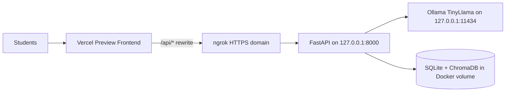

# AIGoat Classroom Deployment

This guide describes how to run AIGoat for a classroom using:

- a protected **Vercel preview deployment** for the React frontend
- an **ngrok HTTPS tunnel** exposing only the FastAPI backend
- **Docker** on the instructor machine for FastAPI, Ollama (TinyLlama), SQLite, and ChromaDB

Do not expose Ollama, SQLite, or ChromaDB directly to the internet. Share only the protected Vercel preview URL with students.

## Architecture



Traffic flow:

1. Students open the protected Vercel preview URL.
2. The browser requests same-origin paths such as `/api/products/`.
3. Vercel rewrites those requests to the instructor ngrok HTTPS domain.
4. ngrok forwards to `127.0.0.1:8000`.
5. FastAPI calls Ollama over the internal Docker network only.

## Prerequisites

On the instructor machine:

| Tool | Purpose |
|------|---------|
| Docker + Compose | Backend, Ollama, persistent data volumes |
| git, curl, openssl, python3, python3-yaml | Setup and config scripts |
| Node.js 18+ and npm | Frontend build and Vercel CLI |
| ngrok account with reserved domain | Public HTTPS tunnel to backend only |
| Vercel account | Protected preview frontend |

Recommended hardware for TinyLlama on CPU:

| Resource | Minimum |
|----------|---------|
| RAM | 8 GB total, several GB free |
| CPU | 4+ cores |
| Disk | 10+ GB free |

## First-Time Setup

1. Clone the repository and enter it:

```bash
git clone https://github.com/AISecurityConsortium/AIGoat.git
cd AIGoat
```

2. Install missing system tools if needed:

```bash
sudo apt update
sudo apt install -y git curl ca-certificates openssl jq python3 python3-yaml nodejs npm ufw
```

Install Docker from Docker's official repository if it is not available. On WSL2, enable Docker Desktop WSL integration.

3. Install ngrok and Vercel CLI if missing:

```bash
# ngrok: follow https://ngrok.com/download for your platform
npm install -g vercel
```

4. Authenticate ngrok:

```bash
ngrok config add-authtoken <your-token>
ngrok config check
```

5. Authenticate Vercel:

```bash
vercel login
```

6. Create local classroom environment file:

```bash
cp .classroom.env.example .classroom.env
```

Edit `.classroom.env` and set your assigned domain:

```bash
NGROK_DOMAIN=your-assigned-domain.ngrok-free.app
```

Do not put the ngrok authtoken in `.classroom.env`.

7. Run local setup:

```bash
chmod +x scripts/classroom/*.sh
./scripts/classroom/setup-local.sh
```

This creates the `ollama_models` volume if needed, generates a classroom secret, builds the classroom stack, pulls TinyLlama when missing, and verifies local health checks.

## ngrok Authentication

If ngrok is not authenticated, setup stops and asks you to run:

```bash
ngrok config add-authtoken <token>
ngrok config check
```

The authtoken belongs in ngrok user configuration, never in the repository.

## Vercel Authentication

After the first preview deployment, enable protection in the Vercel dashboard:

1. Open the Vercel project.
2. Go to **Settings**.
3. Open **Deployment Protection**.
4. Enable **Vercel Authentication** for preview deployments.
5. Protect the current preview deployment.
6. Create a shareable access link only if your plan supports protected preview sharing.
7. Share only the protected Vercel link with students.
8. Do not share the ngrok URL.

If your plan cannot securely share a protected preview with all students, do not make the deployment public. Use an access model your plan supports or upgrade the plan.

## Daily Start Procedure

```bash
./scripts/classroom/start-class.sh
./scripts/classroom/deploy-preview.sh
./scripts/classroom/status.sh
```

`start-class.sh`:

- starts Ollama and backend in Docker
- verifies TinyLlama
- starts ngrok on the assigned domain targeting `127.0.0.1:8000`
- generates `frontend/vercel.json` from the ngrok URL

`deploy-preview.sh`:

- verifies the ngrok endpoint
- builds the frontend locally with same-origin API URLs
- deploys a Vercel preview deployment only
- updates classroom CORS for the preview URL
- tests homepage and `/api/products/`

## Daily Stop Procedure

```bash
./scripts/classroom/stop-class.sh
```

This stops ngrok and the classroom Docker services while preserving database and model volumes.

## Status Checks

```bash
./scripts/classroom/status.sh
./scripts/classroom/check-security.sh
```

## Student Link Instructions

Give students only the protected Vercel preview URL after dashboard protection is enabled.

Demo credentials remain the stock AIGoat demo accounts from the README, for example:

| Username | Password |
|----------|----------|
| `alice` | `password123` |
| `admin` | `admin123` |

Tell students:

- use only the protected Vercel link
- do not enter real personal data
- do not attempt to access backend or Ollama directly

## Reset Procedure

Reset only classroom student progress:

```bash
./scripts/classroom/reset-student-data.sh
```

Non-interactive mode:

```bash
./scripts/classroom/reset-student-data.sh --yes
```

This removes the Docker `aigoat_db_data` volume contents and preserves the external `ollama_models` volume.

## Update Procedure

```bash
git pull
./scripts/classroom/stop-class.sh
./scripts/classroom/setup-local.sh
./scripts/classroom/start-class.sh
./scripts/classroom/deploy-preview.sh
```

Review `git diff` before updating during an active class.

## Backup Procedure

Back up student progress by copying the Docker database volume or exporting the SQLite file from the running backend container.

Preserve model weights by keeping the external Docker volume:

```bash
docker volume inspect ollama_models
```

Do not delete `ollama_models` unless you intentionally want to re-download TinyLlama.

## Troubleshooting

### Docker not running

Symptom: `Cannot connect to the Docker daemon`

Action: start Docker Desktop or `dockerd`, then rerun `./scripts/classroom/setup-local.sh`.

### ngrok domain mismatch

Symptom: tunnel fails to start

Action: verify `NGROK_DOMAIN` in `.classroom.env` matches the reserved domain shown in the ngrok dashboard.

Check current syntax:

```bash
ngrok http --help
```

### Vercel API works locally but not through preview

Symptom: homepage loads, `/api/*` fails

Action:

1. rerun `./scripts/classroom/start-class.sh`
2. rerun `./scripts/classroom/deploy-preview.sh`
3. confirm `frontend/vercel.json` exists and contains the current ngrok hostname

### Chat is slow

TinyLlama on CPU commonly takes longer than Mistral on GPU. Timeouts were increased in `docker/config.classroom.yml`, but concurrent student usage will still queue on a single machine.

### CORS errors in browser devtools

With proper Vercel rewrites, browser requests should be same-origin. If you changed frontend API base URLs to point directly at ngrok, rerun:

```bash
./scripts/classroom/set-vercel-origin.sh https://your-preview.vercel.app
```

## Security Warnings

- AIGoat is intentionally vulnerable software for training.
- Run it only for classroom exercises.
- Never store real credentials, PII, or production secrets.
- Do not expose ports `3000`, `8000`, or `11434` on `0.0.0.0`.
- Do not expose Ollama directly.
- Do not share the ngrok URL with students.
- Do not deploy with `vercel --prod`.
- Review `./scripts/classroom/check-security.sh` before each class.

## Known Limitations

- Single-host classroom setup; concurrency is limited by CPU, RAM, and one Ollama instance.
- ngrok free or personal plan limits apply to bandwidth, connections, and domain features.
- Vercel preview timeouts may interrupt long streaming chat responses.
- TinyLlama responses are weaker and less coherent than Mistral.
- Vercel Authentication sharing depends on your Vercel plan.
- This guide assumes the instructor machine can run Docker. WSL2 requires Docker Desktop integration.

## Vercel Timeout Considerations

Vercel preview routes have platform timeout limits. Long `/api/chat/stream` sessions may disconnect even when the backend is healthy. For demo-heavy classes, prefer shorter prompts and warn students about streaming interruptions.

## ngrok Free-Plan Limits

Reserved domains, connection limits, and request quotas depend on your ngrok plan. Monitor the ngrok dashboard during class.

## TinyLlama vs Mistral

TinyLlama uses much less memory than Mistral and is better suited to classroom laptops, but:

- answers are shorter and less reliable
- complex challenge exploitation may behave differently
- CPU inference can still take many seconds per response

## Firewall

Optional hardening:

```bash
./scripts/classroom/configure-firewall.sh
```

This enables UFW with deny-incoming defaults and avoids opening ports `3000`, `8000`, and `11434`. Localhost-only Docker bindings remain the primary control.

## Files Used by Classroom Mode

| File | Purpose |
|------|---------|
| `docker/config.classroom.yml` | Classroom backend settings |
| `docker/docker-compose.classroom.yml` | Localhost-only port override |
| `.classroom.env` | Reserved ngrok domain (ignored by Git) |
| `.classroom-runtime/` | ngrok PID, URLs, preview URL |
| `frontend/vercel.json` | Generated rewrite rules (ignored by Git) |

## CORS Note

When the browser uses Vercel same-origin rewrites for `/api/*`, CORS usually does not apply. The classroom scripts still add the preview URL to `allowed_origins` for safer operation if any client path calls the backend directly.
