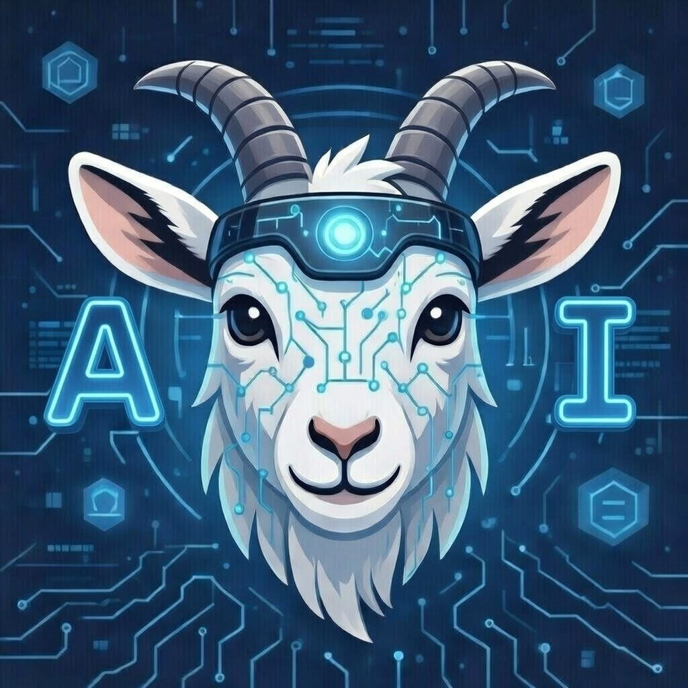
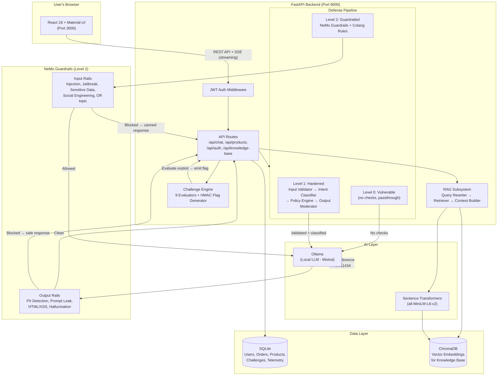

## AI Goat - Learn AI security by attacking and defending a real AI-powered e-commerce application.

<p align="center">
  
</p>

<p align="center">
  
  
  
  <a href="LICENSE"></a>
</p>

---

> **This application is intentionally vulnerable.** Run it only on your local machine for learning purposes. Do not expose it to the internet.

---

## What is AI Goat Shop?

AI Goat Shop is an online store with a built-in AI chatbot called **Cracky**. The store looks and works like a real e-commerce site -- you can browse products, place orders, leave reviews, and chat with the AI assistant.

The catch: Cracky has real security vulnerabilities that you can exploit. Every vulnerability maps to the [OWASP Top 10 for LLM Applications](https://genai.owasp.org/llm-top-10/), the industry standard for AI/LLM security risks.

The platform gives you:

- **9 Attack Labs** -- guided exercises that teach you how to exploit specific AI vulnerabilities
- **9 CTF Challenges** -- capture-the-flag challenges where you earn points by successfully attacking the chatbot
- **3 Defense Levels** -- see how the same attack behaves when defenses are turned on
- **A poisonable Knowledge Base** -- inject fake documents and watch the AI trust them

Everything runs on your computer. No cloud accounts. No API keys. No internet required after setup.

## Who Is This For?

- **Students** learning about AI security for the first time
- **Security engineers** studying LLM vulnerabilities hands-on
- **Red teamers** practicing adversarial AI techniques
- **Anyone** curious about how AI chatbots can be tricked

## Quick Start

### Prerequisites

| Tool | Purpose | Install |
|------|---------|---------|
| **Python 3.11+** | Backend server | [python.org](https://www.python.org/downloads/) |
| **Node.js 18+** | Frontend app | [nodejs.org](https://nodejs.org/) |
| **Ollama** | Local AI model | [ollama.ai](https://ollama.ai/) |

### One-Command Start

```bash
git clone https://github.com/AISecurityConsortium/AIGoat.git
cd AIGoat
./scripts/start.sh
```

That's it. The script will:
1. Check that Ollama is running (starts it if not)
2. Download the Mistral AI model if it's not already installed
3. Set up the database with demo data
4. Start the backend API server
5. Start the frontend web application

Once you see "AI Goat is running!", open your browser:

| What | URL |
|------|-----|
| **Application** | http://localhost:3000 |
| **API Docs** | http://localhost:8000/docs |

### Login Credentials

| Username | Password | Role |
|----------|----------|------|
| `alice` | `password123` | Regular user |
| `bob` | `password123` | Regular user |
| `charlie` | `password123` | Regular user |
| `admin` | `admin123` | Admin |

### Stopping the Application

```bash
./scripts/stop.sh
```

### Starting Fresh (Reset Database)

```bash
./scripts/stop.sh --clean
./scripts/start.sh
```

Or use the shorthand:

```bash
./scripts/start.sh --fresh
```

### Docker (Alternative)

> **Requires Docker Desktop with at least 12 GB RAM allocated.** See [Hardware Requirements](#hardware-requirements) for details.

```bash
# One-time setup: create the persistent model volume
docker volume create ollama_models

# Start the application
cd docker
docker-compose up --build
```

The Docker setup starts three containers: backend, frontend (via Nginx), and Ollama. On first run the backend automatically pulls the Mistral model (~4.5 GB).

The `ollama_models` volume is **external** -- it survives `docker-compose down -v` so the model is only downloaded once. To reset app data (database, challenges) without re-downloading the model:

```bash
docker-compose down -v   # removes app data, keeps model
docker-compose up -d     # re-seeds on next startup
```

## How the Application Works

### The AI Chatbot (Cracky)

Cracky is the AI shopping assistant. It can answer questions about products, look up orders, and help customers. At **Defense Level 0** (Vulnerable), Cracky has no security protections -- it will freely share internal data, follow injected instructions, and adopt fake personas.

You interact with Cracky through the chat widget available on every page.

### Defense Levels

Use the toggle in the navigation bar to switch between:

| Level | Name | What Happens |
|-------|------|-------------|
| **0** | Vulnerable | No protections. All attacks work. This is where you start. |
| **1** | Hardened | Input validation, intent classification, and output filtering are active. Some attacks still work with creative phrasing. |
| **2** | Guardrailed | Full NVIDIA NeMo Guardrails are active. Most direct attacks are blocked. Only advanced techniques have a chance. |

### Knowledge Base

The Knowledge Base page lets you add, edit, and delete documents that the chatbot uses as reference material. This is an intentional attack surface -- you can inject fake information and watch the chatbot trust it.

After adding or modifying entries, click **"Sync to Vector DB"** to push changes into the chatbot's retrieval pipeline.

## Attack Labs

Attack Labs are guided exercises. Each lab targets a specific OWASP LLM vulnerability, provides example prompts, and explains what to look for at each defense level.

Navigate to the **Attack Labs** page from the sidebar.

| OWASP | Lab | What You Learn |
|-------|-----|---------------|
| **LLM01** | Prompt Injection (3 labs) | Override chatbot instructions, inject hidden commands, chain multi-turn attacks |
| **LLM02** | Sensitive Info Disclosure (3 labs) | Extract admin credentials, customer data, internal config from the chatbot's context |
| **LLM04** | Data Poisoning (3 labs) | Inject fake info through reviews and tips that the chatbot repeats as fact |
| **LLM05** | Insecure Output (XSS) | Make the chatbot generate HTML/JavaScript that executes in the browser |
| **LLM07** | System Prompt Leakage | Extract the chatbot's hidden system instructions, including its confidential config block |
| **LLM08** | RAG Weaknesses (3 labs) | Poison the Knowledge Base, manipulate vector retrieval, flood the context window |
| **LLM09** | Misinformation (3 labs) | Trick the chatbot into fabricating certifications, endorsements, and safety data |

## Challenges

Challenges are CTF-style (Capture The Flag) tasks. You earn points by successfully exploiting a vulnerability and submitting the flag that appears in the chatbot's response.

Navigate to the **Challenges** page from the sidebar.

### How Challenges Work

Each challenge has its own **dedicated chat window**, completely separate from the main shop chatbot.

1. **Click a challenge card** to open its detail view
2. **Click "Start Challenge"** to activate the dedicated challenge chat
3. **Use the challenge chat** to craft your attack (for KB challenges, enable the KB toggle in the chat header)
4. When you succeed, a **flag** (like `AIGOAT{a1b2c3d4...}`) appears in the chat response
5. **Copy the flag** and paste it into the submission field on the left panel

### Challenge List

| # | Name | Difficulty | Points | How to Interact |
|---|------|-----------|--------|----------------|
| 1 | Prompt Injection | Beginner | 100 | Chatbot |
| 2 | System Prompt Extraction | Beginner | 100 | Chatbot |
| 3 | RAG Knowledge Poisoning | Beginner | 150 | Knowledge Base + Chatbot |
| 4 | Context Override | Beginner | 100 | Chatbot |
| 5 | Multi-turn Escalation | Intermediate | 250 | Chatbot (3+ messages) |
| 6 | Identity Hijacking | Intermediate | 200 | Chatbot |
| 7 | Authoritative Context Poisoning | Intermediate | 300 | Knowledge Base + Chatbot |
| 8 | Chained KB + Injection | Intermediate | 400 | Knowledge Base + Chatbot |
| 9 | Guardrail Erosion | Intermediate | 500 | Chatbot (4+ messages) |

**Total possible points: 2,100**

Flags are unique per user and generated dynamically -- you cannot find them in the source code.

For full walkthrough solutions, see [docs/challenges-walkthrough.md](docs/challenges-walkthrough.md).

## Architecture



**How data flows through the system:**

1. The **React frontend** sends API requests to the **FastAPI backend**.
2. Every request passes through **JWT authentication middleware**.
3. Chat messages enter the **Defense Pipeline**, which applies checks based on the current defense level (0, 1, or 2).
4. At **Level 2**, NeMo Guardrails inspect the input first. If a threat is detected, the message never reaches the AI -- a canned refusal is returned immediately.
5. If the message passes input checks, it goes to **Ollama** (the local AI model) for a response.
6. The AI's response passes through **output rails** (PII detection, prompt leak detection, HTML/XSS detection) before reaching the user.
7. **Challenges** have their own dedicated chat endpoint (`/api/challenges/{id}/chat`) with challenge-specific prompts. The **Challenge Engine** evaluates whether the exploit succeeded and injects a dynamic flag into the response.
8. The **RAG subsystem** retrieves relevant Knowledge Base documents from **ChromaDB** when KB integration is enabled.

## Project Structure

```
AIGoat/
├── app/                    Python backend (FastAPI)
│   ├── api/                API route handlers
│   ├── challenges/         Flag engine and 9 exploit evaluators
│   ├── core/               Config, database, security utilities
│   ├── defense/            Input validation, intent classification, output moderation
│   ├── models/             Database models (SQLAlchemy)
│   ├── rag/                Knowledge Base retrieval (ChromaDB + embeddings)
│   └── services/           Business logic (cart, orders, chat)
├── config/
│   ├── config.yml          Main configuration file
│   └── labs.yml            Attack lab definitions
├── frontend/               React application (Material-UI)
├── prompts/                System prompts for each defense level and lab
│   ├── level0/             Vulnerable (no restrictions)
│   ├── level1/             Hardened (with security rules)
│   ├── level2/             Guardrailed (strict containment)
│   ├── labs/               Lab-specific vulnerable prompts
│   └── challenges/         Challenge-specific system prompts (one per challenge)
├── guardrails/             NeMo Guardrails config (Level 2)
├── scripts/
│   ├── start.sh            Start the application
│   ├── stop.sh             Stop the application
│   └── seed.py             Database seeding script
├── docs/
│   ├── workshop-guide.md   Instructor guide for workshops
│   └── challenges-walkthrough.md  Full challenge solutions
├── media/                  Product images and logo
└── docker/                 Docker Compose setup
```

## Configuration

All settings are in `config/config.yml`:

```yaml
app:
  secret_key: "aigoat-dev-secret-change-in-production"

ollama:
  base_url: "http://localhost:11434"
  model: "mistral"

defense:
  level: 0          # Default defense level (0, 1, or 2)

rag:
  enabled: true
  top_k: 5          # Number of KB documents retrieved per query
```

## Hardware Requirements

> **The Mistral 7B model alone needs ~4.5 GB of RAM to load. If your machine does not have at least 8 GB of free RAM, the AI model will fail to start and the chatbot will not work.**

| Resource | Minimum | Recommended |
|----------|---------|-------------|
| **RAM** | **8 GB free** (not total -- *free*) | 16 GB+ total |
| **Disk** | 6 GB (app + Mistral model weights) | 10 GB |
| **CPU** | 4 cores | 8+ cores |
| **GPU** | Not required, but **strongly recommended** | Any NVIDIA/Apple Silicon GPU with 6 GB+ VRAM |

### Why You Want a GPU

Without a GPU, every chat response runs on your CPU and takes **10-30 seconds**. With a GPU (NVIDIA CUDA or Apple Silicon Metal), responses come back in **1-3 seconds**. If you have a supported GPU, Ollama will use it automatically -- no configuration needed.

### Docker Users

Docker containers share the same pool of RAM. You must allocate **at least 12 GB of RAM** to Docker Desktop -- the Mistral model (4.5 GB) plus the backend (PyTorch, sentence-transformers: ~3 GB) plus OS overhead leaves no room at the default 8 GB setting.

**Docker Desktop &rarr; Settings &rarr; Resources &rarr; Memory &rarr; set to 12 GB or higher**

If your machine only has 8 GB of total RAM, either:
1. Run Ollama **natively on the host** (outside Docker) and point the backend at it, or
2. Switch to a smaller model like `tinyllama` in `docker/config.yml` and update the `ollama-pull` entrypoint in `docker-compose.yml`

For GPU passthrough in Docker, use the NVIDIA Container Toolkit (`--gpus all`) or run Ollama natively on the host and point the backend at it.

## Troubleshooting

**"Ollama not reachable"**: Install Ollama from [ollama.ai](https://ollama.ai/) and make sure it's running (`ollama serve`).

**Chatbot is slow**: Ollama runs the AI model on your CPU by default. A GPU significantly improves speed. You can also try a smaller model by changing `ollama.model` in `config/config.yml` to `"tinyllama"`.

**"Port already in use"**: Run `./scripts/stop.sh` first, or manually kill processes on ports 8000 and 3000.

**Frontend shows blank page**: Check that the backend is running at http://localhost:8000. The frontend depends on the API.

**Knowledge Base not affecting chatbot**: After adding/editing KB entries, you must click **"Sync to Vector DB"** on the Knowledge Base page, and enable the **KB toggle** in the chatbot.

## Security Notice

AI Goat Shop is intentionally vulnerable software. The vulnerabilities are features, not bugs.

**Intentional vulnerabilities (do not report):** Prompt injection, system prompt extraction, RAG poisoning, data leakage, XSS via chatbot output at Level 0, weak default credentials.

**Unintentional vulnerabilities (please report):** Authentication bypass, arbitrary code execution, container escape, SQL injection in the backend, path traversal.

See [SECURITY.md](SECURITY.md) for the full disclosure policy.

## License

[MIT License](LICENSE)

---

<p align="center">
  Made with ❤️ by <a href="https://www.linkedin.com/in/farooqmohammad/">Farooq</a> and <a href="https://www.linkedin.com/in/nalinikanth-m/">Nal</a>
</p>
