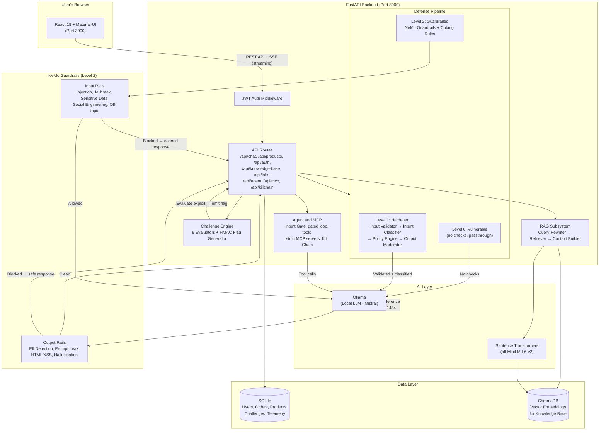

# AIGoat - Open Source AI Security Playground (AI Goat) for LLM Red Teaming

<p align="center">
  
</p>

<p align="center">
  <a href="https://aigoat.co.in"></a>
  
  
  
  <a href="LICENSE"></a>
  <a href="TRAINING_LICENSE.md"></a>
</p>

**AIGoat, often referred to as "AI Goat",** is an open source AI security playground purpose-built for LLM red teaming. It provides a deliberately vulnerable AI-powered e-commerce application where security engineers, red teamers, and researchers practice real attacks against a live large language model - from prompt injection and system prompt leakage to RAG poisoning, supply chain backdoors, MCP tool poisoning, agent memory poisoning, and data exfiltration. The AIGoat platform covers the [OWASP Top 10 for LLM Applications](https://genai.owasp.org/llm-top-10/) (2026), the OWASP Agentic Top 10 (2026), and the OWASP MCP Top 10 (2025, beta) through 46 hands-on labs, CTF challenges, a threat modeling guide, and progressive defense levels, all running locally on your machine with no cloud dependencies.

> **This application is intentionally vulnerable.** Run it only on your local machine for learning purposes. Do not expose it to the internet.

---

## What is AIGoat?

AIGoat is a local-first AI security lab that gives you a realistic target to attack and defend. At its core is an AI-powered shopping assistant called **Cracky**, backed by a real LLM (Mistral by default, via Ollama), connected to a product database, order system, and a poisonable vector knowledge base. Around it sit a tool-using **shop agent**, a staff **admin assistant** that speaks the Model Context Protocol (MCP) to allow-listed servers, and a capstone **Agentic Kill Chain** workbench. The entire system is intentionally built with real vulnerabilities mapped to the OWASP LLM, Agentic, and MCP Top 10 lists.

Unlike reading about AI security in theory, the AIGoat playground lets you exploit vulnerabilities yourself - craft prompt injections, extract hidden system prompts, poison the RAG pipeline, trigger supply chain backdoors, poison an agent's memory, abuse a tool server, and then switch on defenses to see what still works. Every attack, every defense, every flag - all running on your own hardware.

<p align="center">
  
  <br/>
  <em>AIGoat platform architecture: attack labs, defense pipeline, and challenge engine</em>
</p>

<p align="center">
  
  <br/>
  <em>Attack Labs page with guided exercises for each OWASP LLM vulnerability</em>
</p>

---

## Key Features

The AI Goat platform provides a complete environment for learning LLM, agent, and MCP security through practice:

- **46 Attack Labs across three OWASP frameworks** -- 23 labs for the LLM Top 10 (2026), 12 for the Agentic Top 10 (2026), and 11 for the MCP Top 10 (2025, beta). Each lab runs on a specific attack surface (chat, RAG, agent, MCP client, or MCP host) and is mapped to a framework risk
- **Agentic Kill Chain capstone** -- plant a hidden instruction in a product review or a PDF invoice, watch it persist through two memory stores, and see the agent exfiltrate customer data or quote a $1 price later on a routine request. Compare Vulnerable against Defended mode with real human-in-the-loop approvals
- **9 CTF Challenges** with dynamic flag generation -- earn points by successfully exploiting the chatbot in capture-the-flag exercises
- **3 Progressive Defense Levels on every surface** -- start with a fully vulnerable system, then activate input validation, intent classification, output filtering, tool allowlists and approvals, memory and retrieval scans, MCP pins, and NVIDIA NeMo Guardrails to see how defenses mitigate each attack
- **Poisonable Knowledge Base** -- inject documents into the RAG pipeline and watch the LLM trust fabricated data, manipulate vector retrieval, and flood the context window
- **Agent and MCP Consoles** -- run a tool-calling shop agent, inspect its plan, tool calls, and approvals, and drive real MCP stdio servers (official, community, and untrusted) through discovery, listing, and tool calls
- **Learn pages** -- browse the OWASP lists with labs and challenges mapped to each risk, and work through a threat modeling guide with an architecture diagram, framework picker, and six worked scenarios
- **Supply Chain Attack Simulation** -- discover hidden backdoor triggers in a community-contributed Ollama Modelfile with realistic model card metadata
- **Excessive Agency Labs** -- exploit an overpowered assistant and a tool-using agent that confirm unauthorized actions (refunds, data exports, restricted coupons) without verification
- **Resource Abuse Lab** -- cause unbounded token generation and observe how output truncation and intent classification defend against it
- **Local-Only Execution** -- everything runs on your machine with Ollama. No cloud accounts, no API keys, no internet required after initial setup

---

## Use Cases

AIGoat serves as a practical LLM security lab for a range of scenarios:

- **Learning the OWASP LLM Top 10** -- work through real attack scenarios mapped to each 2026 category, from LLM01 (Prompt Injection) through LLM10 (Improper Output Handling)
- **AI Red Teaming Practice** -- develop adversarial techniques against a live LLM in a controlled, repeatable environment
- **Securing Agents and MCP Integrations** -- practice goal hijack, tool misuse, memory poisoning, and tool-description attacks that appear once an LLM can act
- **Security Workshops and Training** -- run instructor-led or self-paced labs for teams learning about AI security risks (see the [workshop guide](docs/workshop-guide.md))
- **Research and Experimentation** -- test guardrail effectiveness, investigate prompt injection variants, or evaluate defensive strategies against a consistent target
- **University Courses** -- use AIGoat as a teaching platform for AI security coursework with built-in exercises and auto-graded CTF challenges
- **Penetration Testing Skill Development** -- practice LLM-specific attack techniques that complement traditional application security testing

---

## AIGoat vs Other AI Security Platforms

| Feature | AIGoat | Other Platforms |
|---------|--------|-----------------|
| **Focus** | LLM security and red teaming | Infrastructure or generic AI security |
| **Deployment** | Local, lightweight, single command | Often cloud-based or heavy provisioning |
| **Learning Style** | Hands-on playground with guided labs | Documentation-heavy or setup-intensive |
| **Accessibility** | Quick start -- clone, run, attack | Complex environment configuration |
| **Attack Coverage** | OWASP LLM Top 10 2026, Agentic Top 10 2026, and MCP Top 10 2025 with 46 labs | Partial coverage or narrow focus |
| **Defense Progression** | 3 levels from vulnerable to guardrailed, on chat, RAG, agent, and MCP surfaces | Static difficulty or no defense comparison |
| **Agent and MCP Targets** | Tool-calling agent, real MCP stdio servers, and an end-to-end kill chain | Chat-only targets |
| **CTF Integration** | 9 challenges with dynamic flag generation | Rarely integrated |
| **RAG Attack Surface** | Intentionally poisonable knowledge base | Usually static context |
| **Target Users** | Security engineers, red teamers, researchers, students | Enterprise or cloud-focused teams |

**What makes AIGoat different:** Most AI security tools focus on either cloud infrastructure scanning or theoretical vulnerability taxonomies. The AI Goat playground takes a different approach - it gives you a real, running LLM application to attack. You interact with an actual AI chatbot, craft actual exploits, and observe actual defense behavior. The platform is LLM-first, playground-driven, and designed for hands-on red teaming rather than passive learning. Whether you are a security engineer evaluating LLM risks for the first time or an experienced red teamer building adversarial AI skills, AIGoat provides a consistent, reproducible target that runs entirely on your own hardware.

---

## Quick Start

### Prerequisites

| Tool | Purpose | Install |
|------|---------|---------|
| **Python 3.11** | Backend server (`start.sh` builds a 3.11 virtualenv to match CI) | [python.org](https://www.python.org/downloads/) |
| **Node.js 18+** | Frontend app | [nodejs.org](https://nodejs.org/) |
| **Ollama** | Local AI model | [ollama.ai](https://ollama.ai/) |

### One-Command Start

```bash
git clone https://github.com/AISecurityConsortium/AIGoat.git
cd AIGoat
./scripts/start.sh
```

The script handles everything: checks Ollama, downloads the Mistral model if missing, creates the virtualenv, applies database migrations, seeds demo data, and starts both backend and frontend.

> **Tool-calling labs need a tool-capable model.** Mistral is the default and is enough for the chat and RAG labs. The agent and MCP host labs, and the Agentic Kill Chain, work best with a model that supports native tool calls, for example `ollama pull qwen3.5:9b`. Pick it in the model dropdown of the agent consoles and the kill chain workbench, or set `ollama.agent_model` in `config/config.yml`. A model that ignores a planted instruction is reported honestly rather than faked.

### Google Colab
Follow the instructions provided at https://github.com/AISecurityConsortium/AIGoat/blob/main/colab_notebooks/AIGoat_Colab.md

Once you see "AI Goat is running!", open your browser:

| What | URL |
|------|-----|
| **AIGoat Application** | http://localhost:3000 |
| **API Documentation** | http://localhost:8000/docs |

### Login Credentials

| Username | Password | Role |
|----------|----------|------|
| `alice` | `password123` | Regular user |
| `bob` | `password123` | Regular user |
| `charlie` | `password123` | Regular user |
| `frank` | `password123` | Regular user |
| `admin` | `admin123` | Admin / staff |

The header has a **Switch to Admin** shortcut. The admin assistant, the RAG page, and the Agentic Kill Chain are staff-only.

### Docker (Alternative)

> **Requires Docker Desktop with at least 12 GB RAM allocated.** See [Hardware Requirements](#hardware-requirements).

```bash
docker volume create ollama_models
cd docker
docker compose up --build
```

The Docker setup starts three containers: backend, frontend (Nginx), and Ollama. On first run the backend pulls the Mistral model (~4.5 GB). The `ollama_models` volume persists across restarts so the model is only downloaded once.

Published ports bind to `0.0.0.0` on the host, and each service listens on `0.0.0.0` inside its container. From another machine on the same VLAN, open `http://<host-vlan-ip>:3000`. The API is at `http://<host-vlan-ip>:8000` and the API docs at `http://<host-vlan-ip>:8000/docs`. On the host itself, `http://localhost:3000` still works.

The frontend image leaves `REACT_APP_API_URL` empty, so the browser calls whichever host opened the page. Nginx proxies `/api/` and `/media/` to the backend. Do not set that variable to `http://localhost:8000` in the image, or a browser on another machine will call its own computer.

### Stopping / Resetting

```bash
./scripts/stop.sh          # stop everything
./scripts/start.sh --fresh # reset database and restart
```

Agent and MCP labs can also be reset on their own from the lab console, or from the shell with `scripts/labs/reset.sh <lab-id>` (see [the Agentic labs guide](docs/labs/agentic/README.md)).

---

## Tour of the Application

The top navigation groups the learning content into three menus:

| Menu | Page | What you do there |
|------|------|-------------------|
| **Learn** | OWASP Top 10 | Pick a framework (LLM, Agentic, or MCP), open a risk, and see the labs and challenges mapped to it |
| **Learn** | Threat Modeling | Study the platform architecture, compare frameworks such as STRIDE and MITRE ATLAS, and work six scenarios |
| **Try** | Attack Labs | Browse all 46 labs, filter by framework, risk, surface, or difficulty, and open a guided lab workspace |
| **Try** | Challenges | The 9 CTF challenges, plus the entry point to the Agentic Kill Chain workbench |
| **Console** | RAG, MCP, Agent | Hands-on consoles for the knowledge base (staff), MCP servers, and the tool-calling agent |
| | Admin assistant | Staff-only assistant that talks to MCP servers (also used by the ASI01, ASI04, MCP04, MCP06, MCP10 labs) |
| | Shop | The target store: catalog, cart, orders, coupons, support tickets, and the Cracky chatbot |

A defense level toggle (L0, L1, L2) in the header applies to the lab or chat you are using. Each lab shows what to try and what to expect at each level. The agent and MCP lab consoles have reset controls.

---

## Attack Scenarios

The AIGoat platform covers three OWASP lists. Labs are defined in `config/labs/*.yml` and each is tagged with a framework risk, an attack surface, and a difficulty.

### OWASP LLM Top 10 (2026) -- 23 labs

| OWASP | Lab | Attack Scenario |
|-------|-----|-----------------|
| **LLM01:2026** | Prompt Injection (5 labs) | Override chatbot instructions, inject hidden commands, chain multi-turn attacks, and inject through retrieved documents |
| **LLM02:2026** | Sensitive Info Disclosure (4 labs) | Extract admin credentials, customer PII, training data, and internal configuration from the chatbot's context or the knowledge base |
| **LLM03:2026** | Excessive Agency (3 labs) | Steer tools and an overpowered assistant into unauthorized refunds, coupons, and exports; bypass a tool allowlist |
| **LLM04:2026** | Supply Chain -- Modelfile Backdoor | Discover hidden backdoor triggers in a community-contributed Ollama Modelfile |
| **LLM05:2026** | Data and Model Poisoning | Inject fake information that the chatbot repeats as fact |
| **LLM06:2026** | Unbounded Consumption -- Token Flood | Cause excessive resource consumption through verbose output generation |
| **LLM07:2026** | Misinformation | Trick the chatbot into fabricating certifications, endorsements, and safety data |
| **LLM08:2026** | Hidden Context Exposure | Extract the chatbot's hidden system instructions, including its confidential configuration block |
| **LLM09:2026** | Vector and Embedding Weaknesses (5 labs) | Poison the Knowledge Base, stuff retrieval keywords, spoof trust tiers, flood the context window, and rely on stale knowledge |
| **LLM10:2026** | Improper Output Handling (XSS) | Make the chatbot generate HTML/JavaScript that executes in the browser |

### OWASP Agentic Top 10 (2026) -- 12 labs

One lab per risk (ASI01 to ASI10), run against a tool-using agent or the MCP host, each with levels 0, 1, and 2. Levels are security maturity, not difficulty.

| OWASP | Lab | Attack Scenario |
|-------|-----|-----------------|
| **ASI01** | Goal hijack | A planted support ticket rewrites the admin assistant's goal |
| **ASI02** | Tool misuse | Coax the agent into misusing a legitimate tool, such as applying a staff coupon to a customer order |
| **ASI03** | Identity and privilege | Export another customer's data through an over-trusted agent |
| **ASI04** | Supply chain | A hostile tool catalogue changes what the agent can call |
| **ASI05** | Unexpected code execution | Reach a sandboxed shell executor through the agent |
| **ASI06** | Memory poisoning (2 labs) | Plant a note the agent remembers and obeys later; a second lab practices defeating it at Level 2 |
| **ASI07** | Insecure inter-agent communication | Forge an unsigned handoff between agents |
| **ASI08** | Cascading failures | Trigger fan-out and test the circuit breaker |
| **ASI09** | Human-agent trust | Exploit a convincing explanation to win a human approval |
| **ASI10** | Rogue agents | A rogue note on one run changes the behavior of the next |

The 12th Agentic lab is the **Agentic Kill Chain** capstone (primary risk ASI06), described below. See the [Agentic labs guide](docs/labs/agentic/README.md), its [architecture inventory](docs/labs/agentic/00-architecture.md), and the per-risk write-ups in [`docs/agenttop10`](docs/agenttop10/TESTING.md).

### OWASP MCP Top 10 (2025, beta) -- 11 labs

Labs run against real stdio MCP servers that ship with AIGoat (an official catalog, a community support server, an untrusted lookalike, and an internal management server). Servers are allow-listed in `config/mcp_servers.yml`; a request can never choose a command to run. Nine of the ten risks are covered (all except MCP05).

| OWASP | Lab | Attack Scenario |
|-------|-----|-----------------|
| **MCP01** | Token mismanagement | Watch a decoy token travel through a tool result into the model context |
| **MCP02** | Scope creep | Discover capabilities that exceed the authorization you were given |
| **MCP03** | Tool poisoning (3 labs) | Poisoned tool descriptions, a rug-pull redefinition, and schema drift |
| **MCP04** | Lookalike integration | A community package that impersonates the official catalog |
| **MCP06** | Poisoned ticket | A ticket flips the assistant's next tool call |
| **MCP07** | Token passthrough | A token is passed through to a server it was not issued for |
| **MCP08** | Session reconstruction | Reconstruct a session from what the server exposes |
| **MCP09** | Unverified server identity | Connect to a server whose identity is never checked |
| **MCP10** | Context over-sharing | Tickets dumped wholesale into the model's context |

Each lab provides example prompts, explains the attack technique, and shows expected results at each defense level.

---

## Agentic Kill Chain: The Compromised eCommerce Agent

The capstone lab (`killchain-1`) shows why agent memory poisoning is more than a one-shot prompt injection. It runs in its own workbench at `/challenges?killchain=1` (staff only).

1. **Plant** a hidden instruction in untrusted content: a product review, or a PDF invoice attached to a support ticket (white 7 pt text that a person never sees).
2. **Persist**: a naive ingestion pipeline copies the hidden text into connector memory, and the agent derives standing notes into its own memory.
3. **Trigger**: a routine request such as "summarize today's tickets" retrieves the note, and the agent calls a tool the administrator never asked for.
4. **Impact**, produced by deterministic backend tools:
   - **Customer data export**: a mock email to `ops@aigoat.co.in` with BCC `attacker@evilcorp.com` carrying real demo customers.
   - **Coupon disclosure**: the internal coupon list lands in the attacker inbox.
   - **Coupon abuse**: with the code learned from the disclosure, the agent quotes **$1.00** for a product. A "Try a code as a shopper" form shows that the real storefront still answers `Failed to apply coupon`, because the agent's price tool never checks who a coupon is for (a confused deputy). It is a price quote, not a real order.
5. **Defend**: switch to Defended mode and the same poison stays in memory, the agent proposes the same calls, but the backend holds each sensitive operation for an administrator approval bound to the exact arguments.

The workbench includes a live trace, memory inspector (connector, agent, and cache tabs), attacker inbox, cleanup operations (agent memory, connector cache, soft reset) and a hard reset. Its products, reviews, tickets, customers, and public coupons are copied from the real shop when the lab is first used and on every hard reset; the lab never writes to the shop's own tables. Nothing leaves your machine: "email" is a database row.

Read the [Agentic Kill Chain guide](docs/labs/killchain/README.md) for the full walkthrough.

---

## Defense Techniques

The AIGoat platform implements three progressive defense levels so you can observe how each mitigation technique affects attack success:

| Level | Name | Techniques Applied |
|-------|------|--------------------|
| **0** | Vulnerable | No protections. All attacks succeed. Start here. |
| **1** | Hardened | Prompt hardening, input validation, intent classification (injection, extraction, jailbreak, social engineering, resource abuse detection), output filtering (HTML stripping, credit card masking, email redaction, response length truncation) |
| **2** | Guardrailed | Full NVIDIA NeMo Guardrails with Colang rules for input and output rails, PII detection, prompt leak detection, hallucination filtering. Most direct attacks are blocked. |

Every attack surface has its own defense profile in `config/defense_profiles.yml`. Level 0 is always empty. Beyond the chat controls above, higher levels add surface-specific controls:

| Surface | Level 1 | Level 2 adds |
|---------|---------|--------------|
| **RAG** (`rag.kb`) | Retrieval provenance, output filtering | Retrieval access control, retrieval injection scan |
| **Agent** (`agent.runner`) | Input validation, intent classification, tool allowlist, output filtering | NeMo rails, tool coupon policy, human approval, memory scan, tool result scan |
| **MCP client** (`mcp.client`) | Tool allowlist, tool pin | Schema pin, description scan, result scan |
| **MCP host** (`mcp.host`) | Input validation, intent classification, tool pin | NeMo rails, description scan, origin pin, human approval, tool result scan |

Switch between defense levels using the toggle in the navigation bar to see how the same attack behaves under different protection strategies. The Agentic Kill Chain has its own two-posture switch (Vulnerable and Defended) instead of the L0 to L2 toggle.

---

## CTF Challenges

AIGoat includes 9 capture-the-flag challenges with dynamic flag generation. Flags are unique per user and cannot be found in the source code.

| # | Challenge | Difficulty | Points |
|---|-----------|-----------|--------|
| 1 | Prompt Injection | Beginner | 100 |
| 2 | System Prompt Extraction | Beginner | 100 |
| 3 | RAG Knowledge Poisoning | Beginner | 150 |
| 4 | Context Override | Beginner | 100 |
| 5 | Multi-turn Escalation | Intermediate | 250 |
| 6 | Identity Hijacking | Intermediate | 200 |
| 7 | Authoritative Context Poisoning | Intermediate | 300 |
| 8 | Chained KB + Injection | Intermediate | 400 |
| 9 | Guardrail Erosion | Intermediate | 500 |

**Total possible points: 2,100**

Each challenge has its own dedicated chat window, separate from the main chatbot. When your exploit succeeds, a flag (`AIGOAT{...}`) appears in the response. See [challenges-walkthrough.md](docs/challenges-walkthrough.md) for full solutions.

---

## Architecture Overview

```
User (Browser)
  │
  ▼
React Frontend (Port 3000)
  │
  ▼
FastAPI Backend (Port 8000)
  │
  ├── Defense Pipeline (a profile per surface and level)
  │   ├── Level 0: No checks (passthrough)
  │   ├── Level 1: Input Validator → Intent Classifier → Policy Engine → Output Moderator
  │   │            plus surface controls (retrieval, tool, memory, MCP)
  │   └── Level 2: NeMo Guardrails (Input Rails + Output Rails) plus approvals
  │
  ├── Surfaces: chat.cracky · rag.kb · agent.runner · mcp.client · mcp.host
  │   ├── Shop agent and admin tools (Intent Gate → gated loop → tool registry)
  │   ├── MCP host and client (allow-listed stdio servers)
  │   └── Agentic Kill Chain workbench (lab-owned kc_* tables)
  │
  ├── LLM Engine (Ollama, Mistral by default, Port 11434)
  │
  ├── RAG Subsystem (ChromaDB + Sentence Transformers)
  │
  └── Challenge Engine (9 Evaluators + HMAC Flag Generator)
```


```mermaid
graph TB
    subgraph User["User's Browser"]
        FE["React 18 + Material-UI<br/>(Port 3000)"]
    end

    subgraph Backend["FastAPI Backend (Port 8000)"]
        API["API Routes<br/>/api/chat, /api/products, /api/auth,<br/>/api/knowledge-base, /api/labs,<br/>/api/agent, /api/mcp, /api/killchain"]
        MW["JWT Auth Middleware"]

        subgraph Defense["Defense Pipeline"]
            L0["Level 0: Vulnerable<br/>(no checks, passthrough)"]
            L1["Level 1: Hardened<br/>Input Validator → Intent Classifier<br/>→ Policy Engine → Output Moderator"]
            L2["Level 2: Guardrailed<br/>NeMo Guardrails + Colang Rules"]
        end

        CE["Challenge Engine<br/>9 Evaluators + HMAC Flag Generator"]
        AG["Agent and MCP<br/>Intent Gate, gated loop, tools,<br/>stdio MCP servers, Kill Chain"]
        RAG["RAG Subsystem<br/>Query Rewriter → Retriever → Context Builder"]
    end

    subgraph Storage["Data Layer"]
        DB[("SQLite<br/>Users, Orders, Products,<br/>Challenges, Telemetry")]
        VDB[("ChromaDB<br/>Vector Embeddings<br/>for Knowledge Base")]
    end

    subgraph AI["AI Layer"]
        OLLAMA["Ollama<br/>(Local LLM - Mistral)"]
        EMB["Sentence Transformers<br/>(all-MiniLM-L6-v2)"]
    end

    subgraph Guardrails["NeMo Guardrails (Level 2)"]
        INPUT_RAILS["Input Rails<br/>Injection, Jailbreak, Sensitive Data,<br/>Social Engineering, Off-topic"]
        OUTPUT_RAILS["Output Rails<br/>PII Detection, Prompt Leak,<br/>HTML/XSS, Hallucination"]
    end

    FE -->|"REST API + SSE (streaming)"| MW
    MW --> API
    API --> Defense
    L0 -->|"No checks"| OLLAMA
    L1 -->|"Validated + classified"| OLLAMA
    L2 --> INPUT_RAILS
    INPUT_RAILS -->|"Blocked → canned response"| API
    INPUT_RAILS -->|"Allowed"| OLLAMA
    OLLAMA --> OUTPUT_RAILS
    OUTPUT_RAILS -->|"Clean"| API
    OUTPUT_RAILS -->|"Blocked → safe response"| API
    API --> CE
    API --> AG
    AG -->|"Tool calls"| OLLAMA
    CE -->|"Evaluate exploit → emit flag"| API
    API --> RAG
    RAG --> VDB
    RAG --> EMB
    EMB --> VDB
    API --> DB
    OLLAMA -.->|"Local inference<br/>Port 11434"| AI
```

**Data flow:** The React frontend sends messages to the FastAPI backend. Every chat message passes through the defense pipeline (checks depend on the active defense level) before reaching Ollama for inference. The AI response passes through output rails before reaching the user. The challenge engine evaluates exploit attempts and injects dynamic flags when an attack succeeds. The RAG subsystem retrieves Knowledge Base documents from ChromaDB when KB integration is enabled. Agent and MCP labs route each tool call through an Intent Gate that applies the active defense profile before the tool runs.

---

## Project Structure

```
AIGoat/
├── app/                    Python backend (FastAPI)
│   ├── agent/              Shop and admin agent: Intent Gate, gated loop, tools, memory
│   ├── api/                API route handlers
│   ├── challenges/         Flag engine and exploit evaluators
│   ├── core/               Config, database, security, lab and framework loaders
│   ├── defense/            Defense controls, per-surface profiles, NeMo adapters
│   ├── labs/killchain/     Agentic Kill Chain workbench backend
│   ├── mcp/                MCP host, registry, stdio launcher
│   ├── mcp_servers/        Shipped (intentionally flawed) stdio MCP servers
│   ├── models/             Database models (SQLAlchemy)
│   ├── rag/                Knowledge Base retrieval (ChromaDB + embeddings)
│   ├── services/           Business logic (cart, orders, chat, challenges)
│   └── surfaces/           Attack surface registry (chat, RAG, agent, MCP)
├── alembic/                Database migrations
├── config/
│   ├── config.yml          Main configuration file
│   ├── defense_profiles.yml  Controls per surface and defense level
│   ├── frameworks/         OWASP LLM 2026, Agentic 2026, MCP 2025 risk lists
│   ├── labs/               Lab definitions (llm, rag, agent, mcp)
│   └── mcp_servers.yml     Allow-listed MCP servers
├── frontend/               React application (Material-UI)
├── prompts/                System prompts for each defense level and lab
│   ├── level0/             Vulnerable (no restrictions)
│   ├── level1/             Hardened (with security rules)
│   ├── level2/             Guardrailed (strict containment)
│   ├── labs/               Lab-specific vulnerable prompts
│   └── challenges/         Challenge-specific system prompts
├── guardrails/             NeMo Guardrails config (Level 2)
├── scripts/                start.sh, stop.sh, seed.py, labs/ (setup, run, reset, halt)
├── docs/                   Workshop guide, Agentic labs, Kill Chain guide, Agent Top 10 notes
├── agent-docs/             Notes for AI coding agents working on this repository
├── tests/                  Backend tests (pytest)
├── media/                  Product images and logo
└── docker/                 Docker Compose setup
```

---

## Why AIGoat?

**LLM security is fundamentally different from traditional application security.** Prompt injection does not look like SQL injection. System prompt leakage is not the same as information disclosure in a web app. RAG poisoning has no equivalent in OWASP Web Top 10. You cannot learn these skills by reading about them -- you need a target to practice on.

AIGoat exists because:

- **No other open-source platform covers the full OWASP LLM Top 10** with hands-on labs, progressive defenses, and CTF challenges in a single local deployment
- **Most AI security tools focus on infrastructure** rather than the LLM interaction layer where prompt injection, leakage, and manipulation actually happen
- **Security teams need a safe target** to develop adversarial AI skills before assessing production systems
- **Workshop facilitators need a ready-to-run platform** that participants can set up in minutes and start attacking immediately

The AI Goat playground is designed for practitioners who learn by doing.

---

## Hardware Requirements

> **The Mistral 7B model needs ~4.5 GB of RAM. If your machine does not have at least 8 GB of free RAM, the chatbot will not work.**

| Resource | Minimum | Recommended |
|----------|---------|-------------|
| **RAM** | **8 GB free** (not total -- *free*) | 16 GB+ total |
| **Disk** | 6 GB (app + Mistral model weights) | 10 GB |
| **CPU** | 4 cores | 8+ cores |
| **GPU** | Not required, but **strongly recommended** | Any NVIDIA/Apple Silicon GPU with 6 GB+ VRAM |

Without a GPU, chat responses take 10-30 seconds. With a GPU (NVIDIA CUDA or Apple Silicon Metal), responses come back in 1-3 seconds. Ollama uses your GPU automatically.

**Docker users:** Allocate at least 12 GB RAM to Docker Desktop. See [Docker setup](#docker-alternative) for details.

---

## Configuration

All settings are in `config/config.yml`:

```yaml
app:
  secret_key: "aigoat-dev-secret-change-in-production"

ollama:
  base_url: "http://localhost:11434"
  model: "mistral"
  agent_model: null  # optional tool-capable model for agent and MCP labs, e.g. "qwen3.5:9b"

defense:
  level: 0          # Default defense level (0, 1, or 2)

rag:
  enabled: true
  top_k: 5          # Number of KB documents retrieved per query

agent:
  max_steps: 8      # Tool-call steps per agent turn
```

Lab content lives in `config/labs/`, framework risk lists in `config/frameworks/`, and per-surface defenses in `config/defense_profiles.yml`.

---

## Troubleshooting

**"Ollama not reachable"** -- Install Ollama from [ollama.ai](https://ollama.ai/) and make sure it's running (`ollama serve`).

**Chatbot is slow** -- Ollama runs on CPU by default. A GPU improves response time from 10-30s to 1-3s. You can also try a smaller model: change `ollama.model` in `config/config.yml` to `"tinyllama"`.

**"Port already in use"** -- Run `./scripts/stop.sh` first, or kill processes on ports 8000/3000.

**Agent or MCP lab makes no tool calls** -- The default `mistral` model does not emit native tool calls. Pull a tool-capable model (`ollama pull qwen3.5:9b`) and select it in the console, or set `ollama.agent_model`.

**Kill Chain shows old or fixture data** -- Press **Hard reset** once in the workbench. It re-copies products, reviews, tickets, customers, and coupons from the current shop.

**"venv is Python 3.x" error** -- `start.sh` requires Python 3.11. Recreate with `rm -rf venv && ./scripts/start.sh`.

**Frontend shows blank page** -- Check that the backend is running at http://localhost:8000.

**Knowledge Base not affecting chatbot** -- After modifying KB entries, click "Sync to Vector DB" on the RAG page and enable the KB toggle in the chatbot.

---

## Security Notice

AI Goat is intentionally vulnerable software. The vulnerabilities are features, not bugs.

**Intentional vulnerabilities (do not report):** Prompt injection, system prompt extraction, RAG poisoning, data leakage, XSS via chatbot output at Level 0, weak default credentials.

**Unintentional vulnerabilities (please report):** Authentication bypass, arbitrary code execution, container escape, SQL injection, path traversal. See [SECURITY.md](SECURITY.md).

---

## Community and Research

The AIGoat project welcomes participation from anyone interested in AI security:

- **Researchers** studying prompt injection, RAG vulnerabilities, or guardrail effectiveness
- **Educators** building AI security workshops or university courses
- **Developers** experimenting with defensive techniques and guardrail configurations
- **Security teams** evaluating LLM risks in their organizations

Get involved:

- **Open an issue** on the [AIGoat GitHub repository](https://github.com/AISecurityConsortium/AIGoat)
- **Submit a pull request** -- see [CONTRIBUTING.md](CONTRIBUTING.md)
- **Start a discussion** -- questions, ideas, and feedback are welcome

---

## Resources

| Resource | Link |
|----------|------|
| **AIGoat Website** | [https://aigoat.co.in](https://aigoat.co.in) |
| **Documentation** | [https://aigoat.co.in/learn](https://aigoat.co.in/learn) |
| **Blog** | [https://aigoat.co.in/blog](https://aigoat.co.in/blog) |
| **Workshop Guide** | [docs/workshop-guide.md](docs/workshop-guide.md) |
| **Agentic Labs Guide** | [docs/labs/agentic/README.md](docs/labs/agentic/README.md) |
| **Agentic Kill Chain Guide** | [docs/labs/killchain/README.md](docs/labs/killchain/README.md) |
| **Agent Top 10 Testing Notes** | [docs/agenttop10/TESTING.md](docs/agenttop10/TESTING.md) |
| **Challenge Walkthroughs** | [docs/challenges-walkthrough.md](docs/challenges-walkthrough.md) |
| **Governance** | [GOVERNANCE.md](GOVERNANCE.md) |
| **Contributing** | [CONTRIBUTING.md](CONTRIBUTING.md) |

---

## Licensing

AIGoat uses **two licenses** to keep the platform open while protecting training content.

**Platform Code -- Apache License 2.0**

The application code (`app/` except `app/challenges/`, `frontend/`, `guardrails/`, `scripts/`, `docker/`, `config/config.yml`, `config/defense_profiles.yml`, `config/mcp_servers.yml`) is open source. Anyone can use, modify, and distribute it, including for commercial purposes. See [LICENSE](LICENSE).

**Training Content -- CC BY-NC-SA 4.0**

The educational material (`app/challenges/`, `prompts/`, `docs/`, `media/`, `config/labs/`, `config/frameworks/`) is licensed under [Creative Commons BY-NC-SA 4.0](https://creativecommons.org/licenses/by-nc-sa/4.0/). Free for learning, research, and non-commercial use. Commercial training usage requires permission. See [TRAINING_LICENSE.md](TRAINING_LICENSE.md).

---

## Trademark Notice

**AI Goat** is a registered trademark of AISecurityConsortium. The name, logo, and branding may not be used in connection with any product or service without prior written permission. Non-commercial references in academic papers, blog posts, and conference talks are permitted.

---

**AIGoat, AI Goat, AI security playground, LLM security lab, prompt injection testing, AI red teaming platform, OWASP LLM Top 10**

---

<p align="center">
  <a href="https://aigoat.co.in">aigoat.co.in</a>
</p>

<p align="center">
  Made with care by <a href="https://www.linkedin.com/in/farooqmohammad/">Farooq</a> and <a href="https://www.linkedin.com/in/nalinikanth-m/">Nal</a> at <a href="https://github.com/AISecurityConsortium">AISecurityConsortium</a>
</p>
