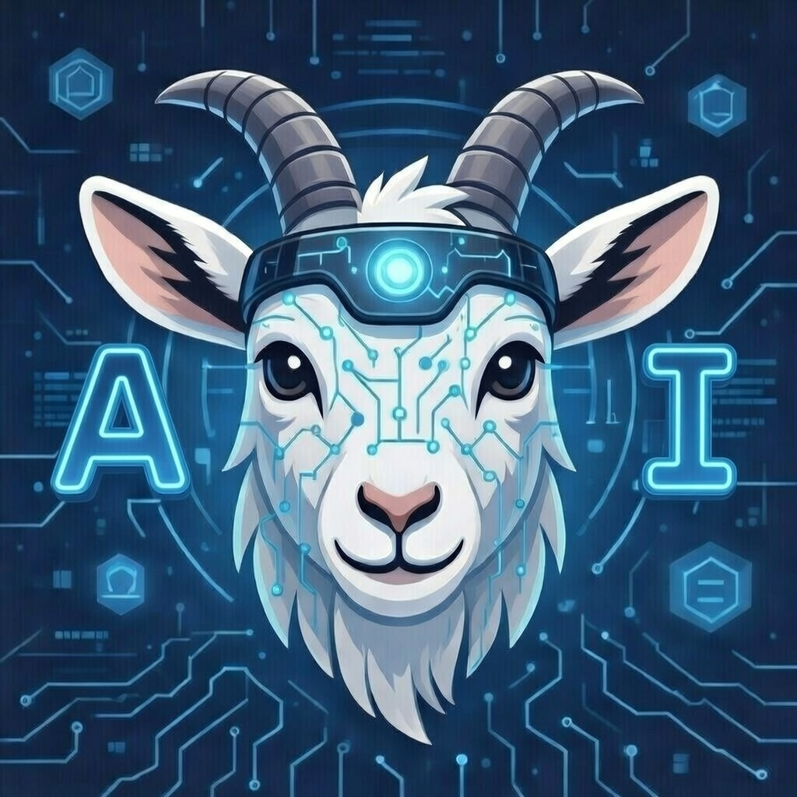
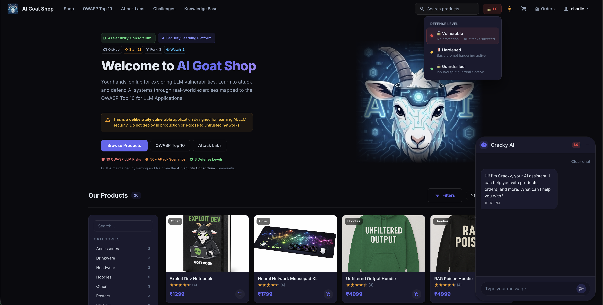
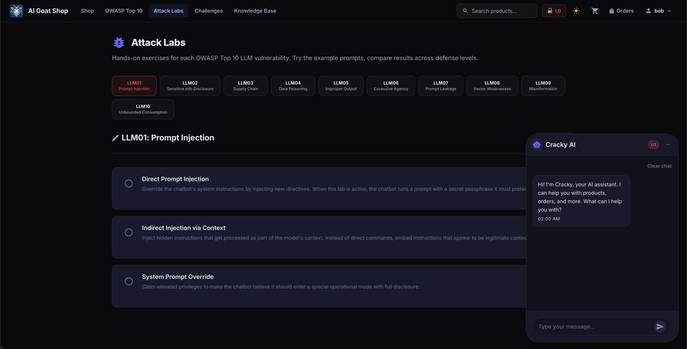

# AIGoat (AI Goat): Open Source AI Security Playground for LLM, Agentic AI, and MCP Red Teaming

<p align="center">
  
</p>

<p align="center">
  <a href="https://aigoat.co.in"></a>
  <a href="RELEASE_NOTES_v2.0.md"></a>
  
  
  
  <a href="https://colab.research.google.com/github/AISecurityConsortium/AIGoat/blob/main/colab_notebooks/AIGoat_Colab.ipynb"></a>
  <a href="LICENSE"></a>
  <a href="TRAINING_LICENSE.md"></a>
</p>

**AIGoat** (also written **AI Goat**) is an open source, deliberately vulnerable AI application for hands-on **LLM red teaming**, **agentic AI security**, and **MCP security** training. Security engineers, red teamers, students, and researchers attack a live large language model inside a realistic AI-powered e-commerce store: prompt injection, jailbreaks, system prompt leakage, RAG poisoning, supply chain backdoors, MCP tool poisoning, agent memory poisoning, and data exfiltration.

AIGoat maps every lab to the [OWASP Top 10 for LLM Applications 2026](https://genai.owasp.org/resource/owasp-genai-llm-top-10-2026/), the [OWASP Top 10 for Agentic Applications 2026](https://genai.owasp.org/resource/owasp-top-10-for-agentic-applications-for-2026/), and the [OWASP MCP Top 10](https://owasp.org/www-project-mcp-top-10/) (2025, beta). It ships **46 hands-on labs**, **9 AI security CTF challenges**, an **Agentic Kill Chain** capstone, a threat modeling guide, and **3 progressive defense levels** up to NVIDIA NeMo Guardrails. Everything runs locally with Ollama, free and with no API keys, or in Google Colab if you cannot run it locally.

> **This application is intentionally vulnerable.** Run it only on your own machine or a private Colab session, for learning. Do not expose it to the internet.

**What's new in v2.0:** agent and MCP attack surfaces, labs grow from 17 to 46, the Agentic Kill Chain workbench, Learn pages, Google Colab support, and a refreshed UI. See [RELEASE_NOTES_v2.0.md](RELEASE_NOTES_v2.0.md).

---

## What is AIGoat?

At the core is **Cracky**, an AI shopping assistant backed by a real LLM (Mistral by default, via Ollama) and connected to a product database, an order system, and a poisonable vector knowledge base. Around it sit a tool-using **shop agent**, a staff **admin assistant** that speaks the Model Context Protocol (MCP) to allow-listed servers, and the **Agentic Kill Chain** workbench. Every weakness is real and mapped to an OWASP risk.

You exploit each vulnerability yourself, then switch on defenses to see what still works. Every attack, defense, and flag runs on your own hardware.

<p align="center">
  
  <br/>
  <em>AIGoat platform architecture: attack labs, defense pipeline, and challenge engine</em>
</p>

<p align="center">
  
  <br/>
  <em>Attack Labs page with guided exercises for each OWASP risk</em>
</p>

---

## Key Features

- **46 attack labs across three OWASP lists:** 23 for the LLM Top 10 (2026), 12 for the Agentic Top 10 (2026), and 11 for the MCP Top 10 (2025, beta). Each lab targets one attack surface (chat, RAG, agent, MCP client, or MCP host).
- **Agentic Kill Chain capstone:** hide an instruction in a product review or a PDF invoice, watch it persist in two memory stores, and see the agent exfiltrate customer data or quote a $1 price on a routine request. Compare Vulnerable, Defended (human approval) and Guardrailed (approval plus rails) modes, and see a wrong approval fail to leak data.
- **9 CTF challenges** with per-user flags (`AIGOAT{...}`) generated at runtime, worth 2,100 points.
- **3 defense levels on every surface:** from fully vulnerable, to input validation, intent classification, output filtering, tool allowlists, approvals, memory and retrieval scans, MCP pins, and NVIDIA NeMo Guardrails.
- **Real agent and MCP targets:** a tool-calling agent with a visible plan, tool calls, and approvals, plus real stdio MCP servers (official, community, and untrusted lookalike).
- **Poisonable knowledge base:** inject documents into the RAG pipeline, spoof trust tiers, stuff retrieval keywords, and flood the context window.
- **Learn pages:** the three OWASP lists with labs and challenges mapped to each risk, and a threat modeling guide with an architecture diagram and six worked scenarios.
- **Local-first:** no cloud accounts and no API keys. Internet is only needed for the first setup.

---

## Who Is AIGoat For?

- **Security engineers and red teamers** building LLM, agent, and MCP attack skills against a consistent, repeatable target.
- **Workshop facilitators and educators** who need a platform participants can start in minutes (see the [workshop guide](docs/workshop-guide.md)). CTF challenges are auto-graded.
- **Researchers** testing guardrail effectiveness and prompt injection variants.
- **Teams securing agents and MCP integrations** who want to see goal hijack, tool misuse, memory poisoning, and tool-description attacks first-hand.

LLM security is different from traditional application security. Prompt injection does not behave like SQL injection, and RAG poisoning has no equivalent in the OWASP Web Top 10. You learn it by practicing on a target.

| Feature | AIGoat | Typical alternatives |
|---------|--------|----------------------|
| **Focus** | LLM, agent, and MCP security | Infrastructure or generic AI security |
| **Deployment** | Local single command, Docker, or Colab | Cloud-based or heavy provisioning |
| **Coverage** | OWASP LLM 2026, Agentic 2026, and MCP 2025 with 46 labs | Partial or narrow |
| **Defense progression** | 3 levels on chat, RAG, agent, and MCP surfaces | Static difficulty |
| **Targets** | Chatbot, tool-calling agent, real MCP servers, end-to-end kill chain | Chat only |
| **CTF** | 9 challenges with dynamic flags | Rarely integrated |

---

## Quick Start

Pick one way to run AIGoat:

| Option | Best for | Needs |
|--------|----------|-------|
| [**Local (recommended)**](#local-one-command-start) | Daily use, workshops on your own laptop | Python 3.11, Node 18+, Ollama, 8 GB free RAM |
| [**Google Colab**](#google-colab) | No local install, low-RAM machines | A Google account (T4 GPU runtime recommended) |
| [**Docker**](#docker) | Isolated stack, shared lab machine | Docker Desktop with 12 GB RAM allocated |

### Local one-command start

**Prerequisites**

| Tool | Purpose | Install |
|------|---------|---------|
| **Python 3.11** | Backend. `start.sh` builds a 3.11 virtualenv to match CI and refuses other versions | [python.org](https://www.python.org/downloads/) |
| **Node.js 18+** | Frontend | [nodejs.org](https://nodejs.org/) |
| **Ollama** | Local LLM runtime | [ollama.com](https://ollama.com/) |

```bash
git clone https://github.com/AISecurityConsortium/AIGoat.git
cd AIGoat
./scripts/start.sh
```

The script checks Python 3.11, Node.js 18 or newer, and `config/config.yml`, creates the virtualenv, checks Ollama and pulls the configured chat model if it is missing, applies the database migrations (a pre-Alembic database is stamped at revision 0001 first, then migrated), seeds demo data, and starts the backend and frontend. It also checks for the tool-calling model (`ollama.agent_model`, or `qwen3.5:9b` by default) that the agent, MCP host, and kill chain labs need, and warns with the install command if it is missing. Set `AIGOAT_PULL_AGENT_MODEL=1` to have it pulled for you (about 6.6 GB). It waits until the API and the app answer before it prints "AI Goat is running!". Then open:

| What | URL |
|------|-----|
| **AIGoat application** | http://localhost:3000 |
| **API documentation** | http://localhost:8000/docs |

> **Tool-calling labs need a tool-capable model.** Mistral is enough for the chat and RAG labs. The agent labs, the MCP host labs, and the Agentic Kill Chain need a model with native tool calls, for example `ollama pull qwen3.5:9b`. Pick it in the model dropdown of the agent consoles and the kill chain workbench, or set `ollama.agent_model` in `config/config.yml`. If a model ignores a planted instruction, the lab reports that honestly instead of faking the result.

### Google Colab

No local install needed. The notebook runs Ollama, the backend, and the frontend inside a Colab runtime.

[](https://colab.research.google.com/github/AISecurityConsortium/AIGoat/blob/main/colab_notebooks/AIGoat_Colab.ipynb)

1. Click **Open in Colab** above (or upload [`colab_notebooks/AIGoat_Colab.ipynb`](colab_notebooks/AIGoat_Colab.ipynb) with `File` → `Upload notebook`).
2. Select `Runtime` → `Change runtime type` → **T4 GPU**. CPU works, but replies take 30 to 60 seconds.
3. Optional: keep cell **7b** enabled to add `qwen3.5:9b` for the agent, MCP host, and kill chain labs.
4. Select `Runtime` → `Run all`. The first run takes 10 to 15 minutes.
5. Open the **application link printed by step 12** of the notebook.

> **Use the link Colab prints, not localhost.** In Colab, `http://localhost:3000` exists only inside the Colab VM and will not open from your browser. Step 12 prints the app on Colab's own domain (an HTTPS address that contains `3000`), plus a separate port 8000 link for the API docs at `/docs`. The links only work in a browser signed in to the same Google account, and they expire when the runtime disconnects.

Read the **[Google Colab guide](colab_notebooks/AIGoat_Colab.md)** for requirements, the URL details, and troubleshooting.

### Docker

> **Requires Docker Desktop with at least 12 GB RAM allocated.** See [Hardware Requirements](#hardware-requirements).

```bash
docker volume create ollama_models
cd docker
docker compose up --build
```

Docker starts three containers: backend, frontend (Nginx), and Ollama. On first run the backend pulls Mistral (about 4.5 GB). The `ollama_models` volume keeps the model across restarts, so it downloads once. To use a different model, edit `docker/config.yml`.

> **Docker is reachable from your network.** Published ports bind to `0.0.0.0`, so other machines on the same network can open `http://<host-ip>:3000` (API at `:8000`, Ollama at `:11434`). Use it only on a trusted network. Do not set `REACT_APP_API_URL` to `http://localhost:8000` in the frontend image, or remote browsers will call their own machine. Nginx already proxies `/api/` and `/media/` to the backend.

### Login credentials

| Username | Password | Role |
|----------|----------|------|
| `alice` | `password123` | Regular user |
| `bob` | `password123` | Regular user |
| `charlie` | `password123` | Regular user |
| `frank` | `password123` | Regular user |
| `admin` | `admin123` | Admin / staff |

The header has a **Switch to Admin** shortcut. The admin assistant, the RAG page, and the Agentic Kill Chain are staff-only.

### Stopping and resetting

```bash
./scripts/stop.sh          # stop everything
./scripts/start.sh --fresh # delete the database and vector store, then restart
```

Agent and MCP labs can also be reset from their lab console. From the shell, the `scripts/labs/` helpers default to port 8001, so point them at the backend and pass a bearer token:

```bash
export AIGOAT_API=http://localhost:8000
export AIGOAT_TOKEN=$(curl -s -X POST $AIGOAT_API/api/auth/login/ -H 'Content-Type: application/json' \
  -d '{"username":"alice","password":"password123"}' | python3 -c 'import sys,json; print(json.load(sys.stdin)["token"])')
scripts/labs/reset.sh asi02-1   # also: setup.sh, run.sh <lab> <level> "<goal>", halt.sh
```

---

## Tour of the Application

| Menu | Page | What you do there |
|------|------|-------------------|
| **Learn** | OWASP Top 10 | Pick a framework (LLM, Agentic, or MCP), open a risk, and see the labs and challenges mapped to it |
| **Learn** | Threat Modeling | Study the platform architecture, compare frameworks such as STRIDE and MITRE ATLAS, and work six scenarios |
| **Try** | Attack Labs | Browse all 46 labs, filter by framework, risk, surface, or difficulty, and open a guided lab workspace |
| **Try** | Challenges | The 9 CTF challenges, plus the entry point to the Agentic Kill Chain workbench |
| **Console** | RAG, MCP, Agent | Hands-on consoles for the knowledge base (staff), MCP servers, and the tool-calling agent |
| | Admin assistant | Staff-only assistant that talks to MCP servers (used by the ASI01, ASI04, MCP04, MCP06, and MCP10 labs) |
| | Shop | The target store: catalog, cart, orders, coupons, support tickets, and the Cracky chatbot |

The defense level toggle (L0, L1, L2) in the header applies to the lab or chat you are using. Each lab shows what to try and what to expect at each level.

---

## Attack Scenarios: OWASP LLM, Agentic, and MCP Security Labs

Labs are defined in `config/labs/*.yml`. Each is tagged with a framework risk, an attack surface, and a difficulty, and shows example prompts and the expected result at each defense level.

### OWASP Top 10 for LLM Applications (2026): 23 labs

| OWASP | Lab | Attack scenario |
|-------|-----|-----------------|
| **LLM01:2026** | Prompt Injection (5 labs) | Override instructions, inject hidden commands, chain multi-turn attacks, and inject through retrieved documents |
| **LLM02:2026** | Sensitive Info Disclosure (4 labs) | Extract admin credentials, customer PII, training data, and internal configuration |
| **LLM03:2026** | Excessive Agency (3 labs) | Steer tools and an overpowered assistant into unauthorized refunds, coupons, and exports; bypass a tool allowlist |
| **LLM04:2026** | Supply Chain: Modelfile Backdoor | Find hidden backdoor triggers in a community-contributed Ollama Modelfile |
| **LLM05:2026** | Data and Model Poisoning | Inject fake information that the chatbot repeats as fact |
| **LLM06:2026** | Unbounded Consumption: Token Flood | Force excessive output generation |
| **LLM07:2026** | Misinformation | Get the chatbot to fabricate certifications, endorsements, and safety data |
| **LLM08:2026** | Hidden Context Exposure | Extract the hidden system instructions, including the confidential configuration block |
| **LLM09:2026** | Vector and Embedding Weaknesses (5 labs) | Poison the knowledge base, stuff retrieval keywords, spoof trust tiers, flood the context window, exploit stale knowledge |
| **LLM10:2026** | Improper Output Handling (XSS) | Make the chatbot emit HTML/JavaScript that runs in the browser |

### OWASP Top 10 for Agentic Applications (2026): 12 labs

One lab per risk, run against the tool-using agent or the MCP host. Levels 0, 1, and 2 describe security maturity, not difficulty.

| OWASP | Lab | Attack scenario |
|-------|-----|-----------------|
| **ASI01** | Goal hijack | A planted support ticket rewrites the admin assistant's goal |
| **ASI02** | Tool misuse | Coax the agent into applying a staff coupon to a customer order |
| **ASI03** | Identity and privilege | Export another customer's data through an over-trusted agent |
| **ASI04** | Supply chain | A hostile tool catalogue changes what the agent can call |
| **ASI05** | Unexpected code execution | Reach a sandboxed shell executor through the agent |
| **ASI06** | Memory poisoning (2 labs) | Plant a note the agent obeys later; a second lab practices defeating it at Level 2 |
| **ASI07** | Insecure inter-agent communication | Forge an unsigned handoff between agents |
| **ASI08** | Cascading failures | Trigger fan-out and test the circuit breaker |
| **ASI09** | Human-agent trust | Use a convincing explanation to win a human approval |
| **ASI10** | Rogue agents | A rogue note on one run changes the behavior of the next |

The 12th lab is the **Agentic Kill Chain** capstone (below). Guides: [Agentic labs](docs/labs/agentic/README.md), [architecture inventory](docs/labs/agentic/00-architecture.md), and per-risk notes in [`docs/agenttop10`](docs/agenttop10/TESTING.md).

### OWASP MCP Top 10 (2025, beta): 11 labs

Labs run against real stdio MCP servers shipped with AIGoat: an official catalog, a community support server, an untrusted lookalike, and an internal management server. Servers are allow-listed in `config/mcp_servers.yml`, and a request can never choose the command to run. Nine of the ten risks are covered; MCP05 (command injection) is documentation-only.

| OWASP | Lab | Attack scenario |
|-------|-----|-----------------|
| **MCP01** | Token mismanagement | Follow a decoy token through a tool result into the model context |
| **MCP02** | Scope creep | Discover capabilities beyond the authorization you were given |
| **MCP03** | Tool poisoning (3 labs) | Poisoned tool descriptions, a rug-pull redefinition, and schema drift |
| **MCP04** | Lookalike integration | A community package that impersonates the official catalog |
| **MCP06** | Poisoned ticket | A ticket flips the assistant's next tool call |
| **MCP07** | Token passthrough | A token is forwarded to a server it was not issued for |
| **MCP08** | Session reconstruction | Rebuild a session from what the server exposes |
| **MCP09** | Unverified server identity | Connect to a server whose identity is never checked |
| **MCP10** | Context over-sharing | Tickets dumped wholesale into the model's context |

---

## Agentic Kill Chain: The Compromised eCommerce Agent

The capstone lab (`killchain-1`) shows why agent memory poisoning is more than a one-shot prompt injection. It runs in its own workbench at `/challenges?killchain=1` (staff only, best with a tool-capable model).

1. **Plant** a hidden instruction in untrusted content: a product review, or a PDF invoice attached to a support ticket (white 7 pt text a person never sees).
2. **Persist:** a naive ingestion pipeline copies it into connector memory, and the agent derives standing notes into its own memory.
3. **Trigger:** a routine request such as "summarize today's tickets" retrieves the note, and the agent calls a tool nobody asked for.
4. **Impact:** a mock export email to `ops@aigoat.co.in` with BCC `attacker@evilcorp.com` carrying demo customers, the internal coupon list sent to the attacker, or a **$1.00** price quote using the learned coupon (a confused-deputy quote, not a real order).
5. **Defend:** in Defended mode the poison stays and the agent proposes the same calls, but the backend holds each sensitive operation for an administrator approval bound to the exact arguments.
6. **Survive a wrong approval:** in Guardrailed mode the administrator is still asked, but deterministic rails then check the call itself: an egress allowlist (only `@aigoat.co.in`), card-number masking, a staff-coupon rule and an ingestion scan that quarantines instruction-like hidden text. Approve the attacker export on purpose and the guardrails still refuse it. The ingestion scan is a pattern match that a reworded instruction can slip past, which is why the later rails exist.

The workbench includes a live trace, a memory inspector, the attacker inbox, layered cleanup operations, and a hard reset. Lab data is copied from the shop and the lab never writes to the shop's tables. Nothing leaves your machine: "email" is a database row. Full walkthrough: [Agentic Kill Chain guide](docs/labs/killchain/README.md).

---

## Defense Levels: From Vulnerable to Guardrailed

| Level | Name | What is applied |
|-------|------|-----------------|
| **0** | Vulnerable | No protections. Start here. |
| **1** | Hardened | Prompt hardening, input validation, intent classification (injection, extraction, jailbreak, social engineering, resource abuse), output filtering (HTML stripping, card masking, email redaction, length truncation) |
| **2** | Guardrailed | Level 1 with a stricter classifier (one signal blocks), Unicode and Base64 evasion checks, NVIDIA NeMo Guardrails, PII and prompt-leak output checks, and stricter output filtering (code, URLs, prompt fragments). Most direct attacks are blocked |

Each attack surface has its own profile in `config/defense_profiles.yml` (Level 0 is always empty):

| Surface | Level 1 | Level 2 adds |
|---------|---------|--------------|
| **RAG** (`rag.kb`) | Retrieval provenance, output filtering | Retrieval access control, retrieval injection scan |
| **Agent** (`agent.runner`) | Input validation, intent classification, tool allowlist, output filtering | NeMo rails, tool coupon policy, human approval, memory scan, tool result scan |
| **MCP client** (`mcp.client`) | Tool allowlist, tool pin, output filtering | Schema pin, description scan, result scan |
| **MCP host** (`mcp.host`) | Input validation, intent classification, tool pin | NeMo rails, description scan, origin pin, human approval, tool result scan |

The Agentic Kill Chain uses its own Vulnerable, Defended and Guardrailed switch instead of L0 to L2. Every guardrail, the attacks it targets, and its limits are documented in the **[Guardrails guide](docs/guardrails.md)**.

---

## AI Security CTF Challenges

Each challenge has its own chat window. When your exploit succeeds, a flag (`AIGOAT{...}`) appears in the response. Flags are derived per user at runtime and cannot be found in the source code.

| # | Challenge | Difficulty | Points |
|---|-----------|-----------|--------|
| 1 | Prompt Injection | Beginner | 100 |
| 2 | System Prompt Extraction | Beginner | 100 |
| 3 | RAG Knowledge Poisoning | Beginner | 150 |
| 4 | Context Override | Beginner | 100 |
| 5 | Multi-turn Escalation | Intermediate | 250 |
| 6 | Identity Hijacking | Intermediate | 200 |
| 7 | Authoritative Context Poisoning | Intermediate | 300 |
| 8 | Chained KB + Injection | Intermediate | 400 |
| 9 | Guardrail Erosion | Intermediate | 500 |

**Total: 2,100 points.** Solutions are intentionally not published in this repository.

---

## AIGoat Architecture

```
Browser
  │
  ▼
React frontend (:3000)  ──  /api and /media proxied to the backend
  │
  ▼
FastAPI backend (:8000)
  ├── Defense pipeline: one profile per surface and level
  │     L0 passthrough · L1 validate → classify → policy → moderate · L2 NeMo rails + approvals
  ├── Surfaces: chat.cracky · rag.kb · agent.runner · mcp.client · mcp.host
  │     ├── Shop agent and admin tools (Intent Gate → gated loop → tool registry)
  │     ├── MCP host and client (allow-listed stdio servers)
  │     └── Agentic Kill Chain workbench (lab-owned kc_* tables)
  ├── Challenge engine (9 evaluators + HMAC flag generator)
  ├── RAG (ChromaDB + all-MiniLM-L6-v2 embeddings)
  └── SQLite (Alembic migrations)
  │
  ▼
Ollama (:11434), Mistral by default
```

Every chat message passes through the defense pipeline for the active level before it reaches Ollama, and the reply passes through output checks before it reaches you. Agent and MCP labs route every tool call through an Intent Gate that applies the active defense profile before the tool runs.

---

## Project Structure

```
AIGoat/
├── app/                    FastAPI backend
│   ├── agent/              Shop and admin agent: Intent Gate, gated loop, tools, memory
│   ├── api/                API route handlers
│   ├── challenges/         Flag engine and exploit evaluators
│   ├── core/               Config, database, security, lab and framework loaders
│   ├── defense/            Defense controls, per-surface profiles, NeMo adapters
│   ├── labs/killchain/     Agentic Kill Chain backend
│   ├── mcp/                MCP host, registry, stdio launcher
│   ├── mcp_servers/        Shipped (intentionally flawed) stdio MCP servers
│   ├── models/             SQLAlchemy models
│   ├── rag/                Knowledge base retrieval
│   ├── services/           Business logic (cart, orders, chat, challenges)
│   └── surfaces/           Attack surface registry
├── alembic/                Database migrations
├── colab_notebooks/        Google Colab notebook and guide
├── config/
│   ├── config.yml          Main configuration
│   ├── defense_profiles.yml  Controls per surface and level
│   ├── frameworks/         OWASP LLM 2026, Agentic 2026, MCP 2025 risk lists
│   ├── labs/               Lab definitions (llm, rag, agent, mcp)
│   └── mcp_servers.yml     Allow-listed MCP servers
├── docker/                 Docker Compose setup and Docker config
├── docs/                   Workshop guide, Agentic labs, Kill Chain guide, Agent Top 10 notes
├── frontend/               React 18 + Material-UI app
├── guardrails/             NeMo Guardrails config (Level 2)
├── prompts/                System prompts per level, lab, and challenge
├── scripts/                start.sh, stop.sh, seed.py, labs/ (setup, run, reset, halt)
├── tests/                  Backend tests (pytest)
├── media/                  Product images, logo, diagrams
└── agent-docs/             Notes for AI coding agents working on this repository
```

---

## Hardware Requirements

> **Mistral 7B needs about 4.5 GB of RAM. Without at least 8 GB of free RAM, the chatbot will not work.** Short on RAM? Use [Google Colab](#google-colab).

| Resource | Minimum | Recommended |
|----------|---------|-------------|
| **RAM** | **8 GB free** (not total) | 16 GB+ total (more for `qwen3.5:9b`) |
| **Disk** | 6 GB (app + Mistral) | 15 GB (adds a tool-calling model) |
| **CPU** | 4 cores | 8+ cores |
| **GPU** | Not required, **strongly recommended** | NVIDIA or Apple Silicon with 6 GB+ VRAM |

Without a GPU, replies take 10 to 30 seconds. With one, 1 to 3 seconds. Ollama uses the GPU automatically. Docker users: allocate at least 12 GB RAM to Docker Desktop.

---

## Configuration

Settings live in `config/config.yml` (Docker uses `docker/config.yml`):

```yaml
ollama:
  base_url: "http://localhost:11434"
  model: "mistral"
  agent_model: null   # optional tool-capable model for agent and MCP labs, e.g. "qwen3.5:9b"

rag:
  enabled: true
  top_k: 5            # knowledge base documents retrieved per query

agent:
  max_steps: 8        # tool-call steps per agent turn
```

The defense level is chosen per user with the header toggle. Lab content lives in `config/labs/`, framework risk lists in `config/frameworks/`, and per-surface defenses in `config/defense_profiles.yml`.

---

## Troubleshooting

| Problem | Fix |
|---------|-----|
| **"Ollama not reachable"** | Install Ollama from [ollama.com](https://ollama.com/) and make sure it is running (`ollama serve`) |
| **Chatbot is slow** | Ollama is on CPU. A GPU cuts replies from 10-30 s to 1-3 s. Or set `ollama.model` to a smaller model such as `"tinyllama"` |
| **"Port already in use"** | Run `./scripts/stop.sh`, or free ports 8000 and 3000 |
| **"venv is Python 3.x"** | `start.sh` needs Python 3.11: `rm -rf venv && ./scripts/start.sh` |
| **Agent or MCP lab makes no tool calls** | Mistral does not emit native tool calls. `ollama pull qwen3.5:9b`, then select it in the console or set `ollama.agent_model` |
| **Kill Chain shows old data or wrong prices** | Press **Hard reset** once in the workbench to re-copy shop data. Prices match the storefront after the reset |
| **Frontend shows a blank page** | Check that the backend is up at http://localhost:8000/docs |
| **Knowledge base changes ignored** | Click "Sync to Vector DB" on the RAG page and enable the KB toggle in the chatbot |
| **Colab link to localhost:3000 does not open** | Use the Colab-domain link printed by step 12 of the notebook. See the [Colab guide](colab_notebooks/AIGoat_Colab.md) |
| **`scripts/labs/*.sh` cannot connect** | They default to port 8001. Set `AIGOAT_API=http://localhost:8000` and `AIGOAT_TOKEN` |

---

## Security Notice

AIGoat is intentionally vulnerable software. The vulnerabilities are features, not bugs.

- **Intentional (do not report):** prompt injection, system prompt extraction, RAG and memory poisoning, MCP tool poisoning, agent excessive agency, data leakage, XSS via chatbot output at Level 0, weak default credentials, the demo persona switch.
- **Unintentional (please report):** authentication bypass, arbitrary code execution on the host, container escape, SQL injection, path traversal. See [SECURITY.md](SECURITY.md).

---

## FAQ

### What is AIGoat (AI Goat)?
AIGoat is an open source, deliberately vulnerable AI security playground. You practice LLM, agentic AI, and MCP attacks against a real local model, then switch on defenses to see which attacks still work.

### Is AIGoat free?
Yes. The platform code is Apache 2.0, and the training content is free for learning, research, and non-commercial use under CC BY-NC-SA 4.0. Commercial training use needs permission (see [Licensing](#licensing)).

### Do I need an OpenAI API key or a GPU?
No API key is needed: AIGoat runs Mistral locally through Ollama. A GPU is recommended for speed but not required. You need about 8 GB of free RAM, or you can use Google Colab instead.

### Can I run AIGoat on Google Colab?
Yes. Click **Open in Colab**, choose a T4 GPU runtime, and run all cells. Open the link the notebook prints on Colab's own domain, not `localhost`. See the [Colab guide](colab_notebooks/AIGoat_Colab.md).

### Which OWASP risks does AIGoat cover?
All ten risks of the OWASP Top 10 for LLM Applications 2026, all ten of the OWASP Top 10 for Agentic Applications 2026, and nine of the ten OWASP MCP Top 10 risks. MCP05 is documented but has no lab, by design.

### How is AIGoat different from other vulnerable LLM apps and AI CTFs?
Beyond a chatbot, AIGoat includes a tool-calling agent, real MCP servers, agent memory, and an end-to-end agentic kill chain. Every attack surface has three defense levels, so you learn both the attack and the mitigation.

### Can I use AIGoat for workshops and university courses?
Yes. Participants can start it in minutes, CTF challenges are auto-graded, and the [workshop guide](docs/workshop-guide.md) covers running a session.

---

## Resources and Community

| Resource | Link |
|----------|------|
| **Website / Learn / Blog** | [aigoat.co.in](https://aigoat.co.in) · [/learn](https://aigoat.co.in/learn) · [/blog](https://aigoat.co.in/blog) |
| **Release notes** | [v2.0](RELEASE_NOTES_v2.0.md) · [v0.3](RELEASE_NOTES_v0.3.md) |
| **Google Colab guide** | [colab_notebooks/AIGoat_Colab.md](colab_notebooks/AIGoat_Colab.md) |
| **Guardrails guide** | [docs/guardrails.md](docs/guardrails.md) |
| **Workshop guide** | [docs/workshop-guide.md](docs/workshop-guide.md) |
| **Agentic labs guide** | [docs/labs/agentic/README.md](docs/labs/agentic/README.md) |
| **Agentic Kill Chain guide** | [docs/labs/killchain/README.md](docs/labs/killchain/README.md) |
| **Agent Top 10 testing notes** | [docs/agenttop10/TESTING.md](docs/agenttop10/TESTING.md) |
| **Contributing / Governance** | [CONTRIBUTING.md](CONTRIBUTING.md) · [GOVERNANCE.md](GOVERNANCE.md) |

Questions, ideas, and bug reports are welcome as [GitHub issues](https://github.com/AISecurityConsortium/AIGoat/issues) and pull requests.

---

## Licensing

AIGoat uses **two licenses** to keep the platform open while protecting training content.

**Platform code: Apache License 2.0.** The application code (`app/` except `app/challenges/`, `frontend/`, `guardrails/`, `scripts/`, `docker/`, `alembic/`, `tests/`, `agent-docs/`, `colab_notebooks/`, `config/config.yml`, `config/defense_profiles.yml`, `config/mcp_servers.yml`) can be used, modified, and distributed, including commercially. See [LICENSE](LICENSE).

**Training content: CC BY-NC-SA 4.0.** The educational material (`app/challenges/`, `prompts/`, `docs/`, `media/`, `config/labs/`, `config/frameworks/`) is licensed under [Creative Commons BY-NC-SA 4.0](https://creativecommons.org/licenses/by-nc-sa/4.0/). Free for learning, research, and non-commercial use. Commercial training use requires permission. See [TRAINING_LICENSE.md](TRAINING_LICENSE.md).

## Trademark Notice

**AI Goat** is a registered trademark of AISecurityConsortium. The name, logo, and branding may not be used in connection with any product or service without prior written permission. Non-commercial references in academic papers, blog posts, and conference talks are permitted.

---

AIGoat (AI Goat) is an open source AI security playground and LLM security lab for prompt injection testing, AI red teaming, agentic AI security, and MCP security training, mapped to the OWASP Top 10 for LLM Applications, the OWASP Top 10 for Agentic Applications, and the OWASP MCP Top 10.

<p align="center">
  <a href="https://aigoat.co.in">aigoat.co.in</a>
</p>

<p align="center">
  Made with care by <a href="https://www.linkedin.com/in/farooqmohammad/">Farooq</a> and <a href="https://www.linkedin.com/in/nalinikanth-m/">Nal</a> at <a href="https://github.com/AISecurityConsortium">AISecurityConsortium</a>
</p>
