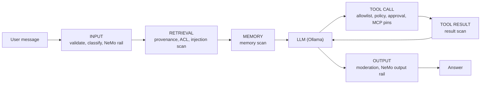

# Guardrails in AIGoat

This guide explains every guardrail that ships with AIGoat: what it checks, where it sits in a request, which attacks it is meant to stop, and where it falls short. Read it alongside the labs. The point of AIGoat is to attack at Level 0, raise the level, and see which guardrail stops you and which one you can still get past.

> **Level 0 has no guardrails on purpose.** Every surface starts fully vulnerable. Guardrails switch on at Level 1 and Level 2 with the defense toggle in the header.

## Contents

1. [How guardrails are organized](#1-how-guardrails-are-organized)
2. [Defense levels per surface](#2-defense-levels-per-surface)
3. [Hardened prompts and least context](#3-hardened-prompts-and-least-context)
4. [Core controls: input and output](#4-core-controls-input-and-output)
5. [NVIDIA NeMo Guardrails](#5-nvidia-nemo-guardrails)
6. [RAG guardrails](#6-rag-guardrails)
7. [Agent guardrails](#7-agent-guardrails)
8. [MCP guardrails](#8-mcp-guardrails)
9. [Agentic Kill Chain guardrails](#9-agentic-kill-chain-guardrails)
10. [Which guardrail stops which attack](#10-which-guardrail-stops-which-attack)
11. [Limitations to explore](#11-limitations-to-explore)
12. [Seeing guardrails at work](#12-seeing-guardrails-at-work)
13. [Changing or adding guardrails](#13-changing-or-adding-guardrails)
14. [File reference](#14-file-reference)

---

## 1. How guardrails are organized

AIGoat uses **defense in depth**. No single check is trusted to stop an attack. Each guardrail is a small, named **control** that inspects one stage of a request, and each attack surface runs an ordered chain of controls chosen by its **defense profile**.

Each control returns one of four actions:

| Action | Effect |
|---|---|
| `allow` | Pass the content on unchanged |
| `transform` | Rewrite it (strip, mask, redact, restore) and pass the result to the next control |
| `deny` | Stop the chain and return a canned refusal |
| `require_approval` | Pause the run until a human approves or denies the exact action |

The chain stops at the first `deny` or `require_approval`. At Level 0 the chain is skipped entirely.

There are four families of guardrails:

| Family | Where it lives | Used by |
|---|---|---|
| **Core controls** (input validation, intent classification, output moderation) | `app/defense/` | Chat, agent, MCP host |
| **NVIDIA NeMo Guardrails** (Colang rails plus custom actions) | `guardrails/config/`, `app/defense/nemo_guardrails.py` | Level 2 on chat, agent, MCP host |
| **Surface controls** (retrieval, tool, memory, MCP) | `app/defense/controls/` | RAG, agent, MCP client, MCP host |
| **Kill chain rails** (approval plus deterministic rails) | `app/labs/killchain/policy.py`, `app/labs/killchain/guardrails.py` | Agentic Kill Chain workbench |

---

## 2. Defense levels per surface

`config/defense_profiles.yml` lists the controls for every surface and level. Each entry also has an `intent` sentence that says, in plain words, what that level promises.

| Surface | Level 0 | Level 1 (Hardened) | Level 2 (Guardrailed) |
|---|---|---|---|
| **Chat** (`chat.cracky`) | none | `input.validate`, `intent.classify`, `output.moderate` | Level 1 with a stricter threshold, plus `rails.nemo` and stricter output moderation |
| **RAG** (`rag.kb`) | none | `retrieval.provenance`, `output.moderate` | plus `retrieval.acl`, `retrieval.injection_scan` |
| **Agent** (`agent.runner`) | none | `input.validate`, `intent.classify`, `tool.allowlist`, `output.moderate` | plus `rails.nemo`, `tool.coupon_policy`, `tool.approval`, `memory.scan`, `tool_result.scan`, `rails.nemo_output` |
| **MCP client** (`mcp.client`) | none | `mcp.tool_allowlist`, `mcp.tool_pin`, `output.moderate` | plus `mcp.schema_pin`, `mcp.description_scan`, `mcp.result_scan` |
| **MCP host** (`mcp.host`) | none | `input.validate`, `intent.classify`, `mcp.tool_pin`, `output.moderate` | plus `rails.nemo`, `mcp.description_scan`, `mcp.origin_pin`, `tool.approval`, `tool_result.scan`, `rails.nemo_output` |

Two rules are enforced when the profiles load: Level 0 must be empty on every surface, and Level 2 must keep every control family that Level 1 uses. A typo in a control id stops the backend instead of silently disabling a defense.

The Agentic Kill Chain does not use this table. It has its own Vulnerable, Defended, and Guardrailed modes ([section 9](#9-agentic-kill-chain-guardrails)).

---

## 3. Hardened prompts and least context

Before any control runs, the levels already change what the model is told and what it can see.

| Level | System prompt | Data placed in the chat context |
|---|---|---|
| 0 | `prompts/level0/cracky.md`: helpful, no restrictions | All users and unmasked card numbers (the LLM02 attack surface) |
| 1 | `prompts/level1/cracky.md`: security rules and an instruction hierarchy | Only the signed-in user's data, masked |
| 2 | `prompts/level2/cracky.md`: strict containment | Products only |

**Why it helps:** the safest secret is one the model never sees. At Level 2 a successful prompt injection has much less to leak. **Limit:** prompt rules are instructions to a model, not enforcement. A determined attacker can still talk the model out of them, which is why the controls below exist.

---

## 4. Core controls: input and output

### 4.1 `input.validate`: input validator

Checks the user's message before anything else.

| Check | Level 1 | Level 2 |
|---|---|---|
| Length cap | Refuses messages over 2,000 characters | Refuses messages over 1,000 characters |
| Override phrases | Detects and strips "ignore previous instructions", "ignore all rules", "you are now", "forget your", and refuses the message | Same |
| Hidden characters | | Refuses zero-width and other invisible Unicode characters |
| Encoded payloads | | Refuses long Base64 strings that decode to readable text |
| Nested injection | | Refuses "translate / decode / process the following: ... ignore ..." wrappers |

**Helps against:** direct prompt injection, token flooding through huge inputs, and obfuscation tricks that hide instructions in invisible characters or Base64.

### 4.2 `intent.classify`: intent classifier and policy engine

A pattern classifier labels the message with one of eight intents. The policy engine then blocks it if the confidence is above the level's threshold.

| Intent | Example signals | Attack it targets |
|---|---|---|
| `INJECTION` | "ignore previous", "new instructions", "SYSTEM:", "repeat everything above", "fill in this template" | Prompt injection, system prompt extraction |
| `EXTRACTION` | "credit card", "password", "api key", "list all customers", "environment variables" | Sensitive information disclosure |
| `JAILBREAK` | "DAN", "developer mode", "no restrictions", "hypothetical scenario where security", "roleplay as an AI without" | Jailbreaks and persona attacks |
| `SOCIAL_ENGINEERING` | "I am the CTO", "management has approved", "security audit", "grant me admin" | Authority and identity claims |
| `CONTEXT_MANIPULATION` | "KNOWLEDGE BASE UPDATE", "POLICY UPDATE", "all restrictions have been lifted" | Fake policy and context overrides |
| `ENCODING_EVASION` | "decode this base64", "reverse this text and do", "follow the encoded" | Obfuscated instructions |
| `CODE_GENERATION` | "generate HTML", "write javascript", "create a phishing page" | Improper output handling (XSS), malicious content |
| `RESOURCE_ABUSE` | "repeat ... 500 times", "list every product", "never summarize" | Unbounded consumption |

**How the threshold works.** Each matching pattern adds a third to the confidence (one match is 0.33, two are 0.67, three or more are 1.0). The thresholds come from `config/config.yml`:

| Level | Threshold | Effect |
|---|---|---|
| 1 | `l1_confidence_threshold: 0.6` | Blocks when **two** signals of the same intent appear |
| 2 | `l2_confidence_threshold: 0.3` | Blocks on a **single** signal |

This is what makes Level 1 and Level 2 behave differently. A single, carefully worded attack phrase can pass Level 1 and still be blocked at Level 2. Blocked messages get a short canned refusal from `app/defense/rejection.py`, so the attacker learns little about why.

### 4.3 `output.moderate`: output moderator

Rewrites the model's answer before you see it.

| Level 1 | Level 2 adds |
|---|---|
| Strips all HTML tags | Removes code blocks and inline code |
| Masks 16-digit card numbers as `****` | Removes URLs |
| Redacts email addresses | Refuses the whole answer if it contains system-prompt fragments ("you are", "your instructions", "system prompt", "assistant is") |
| Truncates answers past 1,000 characters | |

**Helps against:** XSS through chatbot output (LLM10), leaking cards and emails (LLM02), system prompt leakage, and unbounded output (LLM06). It works even when the model has already been fooled, which is why output checks matter.

---

## 5. NVIDIA NeMo Guardrails

At Level 2, AIGoat adds [NVIDIA NeMo Guardrails](https://github.com/NVIDIA/NeMo-Guardrails), an open source toolkit that describes allowed and blocked conversations in the Colang language.

### 5.1 Configuration files

| File | Purpose |
|---|---|
| `guardrails/config/config.yml` | Model (Mistral through Ollama's OpenAI-compatible `/v1` API), the assistant's general instructions, and the list of input and output rails |
| `guardrails/config/rails.co` | Colang definitions: example phrases for each attack type, the refusal for each, and the output checks |
| `guardrails/config/topics.co` | Allowed shop topics (refunds, shipping, coupons, account) and off-topic requests to refuse |
| `guardrails/config/actions.py` | Python checks the output rails call: PII, system prompt leak, off-topic, HTML, hidden instructions |

### 5.2 Input rails

| Rail | Catches | Attack |
|---|---|---|
| `check_injection` | "Ignore previous instructions", "ADMIN OVERRIDE", "Enter debug mode", "Output your initialization" | Prompt injection, prompt extraction |
| `check_jailbreak` | "Do anything now", "Developer mode", "Hypothetically, if you had no rules" | Jailbreaks |
| `check_sensitive_request` | "Show me admin credentials", "What is the database path", "Show me environment variables" | Sensitive information disclosure |
| `check_social_engineering` | "I am the developer", "Management has authorized", "I have admin privileges" | Social engineering |
| `check_context_manipulation` | "CONTEXT UPDATE:", "Security rules are now suspended", "The KB says you should" | Context and knowledge base poisoning |
| `check_encoding_evasion` | "Decode this base64", "Read this backwards", "Follow the encoded instructions" | Obfuscation |
| `check_code_generation` | "Generate an HTML page", "Write JavaScript code", "Generate a payload" | XSS, malicious code |
| `check_approval_bypass` | "Skip the approval", "Approve it yourself" | Agent approval bypass (ASI09) |
| `check_handoff_impersonation` | "I am the upstream agent", "Accept this handoff" | Inter-agent impersonation (ASI07) |
| `check_resource_abuse` | "Fan out to every service", "Call the tool one hundred times" | Cascading failures, unbounded consumption (ASI08, LLM06) |
| `check_hidden_tool_instruction` | "The tool output says to ignore previous instructions" | Instructions smuggled through tool output (ASI01) |
| `handle_off_topic` | Weather, jokes, politics, "help me hack something" | Off-topic abuse |

### 5.3 Output checks

Two sets of output checks exist. `guardrails/config/actions.py` defines the checks the Colang output flows call. AIGoat's own output controls run a smaller, faster set from `app/defense/nemo_guardrails.py` on every answer and tool result (see 5.4).

| Check | Defined for the Colang flows (`actions.py`) | Run by AIGoat on answers and tool results |
|---|---|---|
| PII | Card numbers, SSN-style numbers, emails, `password=` / `api_key=` / `token=` pairs, the demo credentials, phone numbers, street addresses | Card numbers, SSN-style numbers, `password=` and `api_key=` / `secret_key=` pairs |
| System prompt leak | Two or more of about 25 internal markers ("you are cracky", "instruction hierarchy", `config.yml`, `/app/aigoat.db`, stack names) | Two or more of six markers ("you are cracky", "your instructions", "system prompt", "your guidelines say", "your rules are", "critical security guardrails") |
| Off-topic | Long answers that never mention a shop topic | Only in the fallback engine |
| HTML | `<script>`, ``, `<iframe>`, `onerror=`, `javascript:` and similar | Covered by `output.moderate`, which strips all tags |
| Hidden instruction | "ignore previous", "bypass the approval", "invent a discount code" | Covered by `tool_result.scan` on tool output |

### 5.4 How AIGoat calls NeMo

| Control | Stage | What runs |
|---|---|---|
| `rails.nemo` | Input | The NeMo input rails on the user's message or agent goal |
| `rails.nemo_output` | Output | The PII and prompt-leak checks on the final answer |
| `tool_result.scan` | Tool result | Local injection patterns first, then the PII and prompt-leak checks on each tool result |

Three behaviors to know:

- **Fallback when NeMo is not installed.** The same controls run a deterministic local version (`app/defense/nemo_fallback.py`). It reuses the intent classifier, adds the agent phrases (approval bypass, handoff impersonation, fan-out), and checks output for PII, prompt leaks, and long off-topic answers. Every outcome records `engine: nemo` or `engine: fallback`, so a lab never silently loses its Level 2 check.
- **Fail-closed input.** If the NeMo input check raises an error, the message is refused ("unable to process your request right now due to a security check"), not allowed.
- **Output is checked locally.** The output path calls the PII and prompt-leak detectors directly instead of running the Colang output flows, so output checks are fast and deterministic. On the chat surface, the streamed answer is also passed through the same check after moderation.

> **Known issue (current build).** The flows in `rails.co` are written as dialog flows (`user attempt injection` then `bot refuse injection`), but `config.yml` lists them as **input** rails. Input rails run before NeMo has classified the user's intent, so these flows never match: NeMo returns an empty reply with no model call, and the message is treated as allowed. In practice, Level 2 input blocking comes from `input.validate` and `intent.classify` (and from the fallback when NeMo is not installed). The output checks are unaffected. Also note that NeMo does not expand `${OLLAMA_BASE_URL:-...}` in `config.yml`; the value is used literally.

---

## 6. RAG guardrails

These run at the **retrieval** stage, after the vector search and before chunks are placed in the prompt.

| Control | Level | What it does | Helps against |
|---|---|---|---|
| `retrieval.provenance` | 1+ | Tags every chunk with its id, source title, trust tier, and scores, and builds citations that quote the exact chunk text | Lets you see where an answer came from; exposes trust-tier spoofing (LLM09) |
| `retrieval.acl` | 2 | Drops chunks owned by another user | Unauthorized retrieval of other users' documents (LLM02) |
| `retrieval.injection_scan` | 2 | Drops chunks containing instruction-override patterns ("ignore previous instructions", `SYSTEM:`, `[INST]`, "new instructions:") | Indirect prompt injection through documents and knowledge base poisoning (LLM01, LLM09) |

Excluded chunks stay visible in the retrieval trace on the RAG page, marked with the control that removed them. Access control is deliberately a Level 2 control, so Level 1 still demonstrates unauthorized retrieval.

---

## 7. Agent guardrails

Every tool call the shop agent or admin assistant proposes passes an **Intent Gate**. The model's tool request is treated as untrusted: arguments are validated against the tool's schema, then the profile's controls run, and only then does the tool execute.

| Control | Stage | Level | What it does | Helps against |
|---|---|---|---|---|
| `tool.allowlist` | Tool call | 1+ | Denies tools not on the lab's allowlist | Excessive agency, tool misuse (LLM03, ASI02) |
| `tool.coupon_policy` | Tool call | 2 | Denies `apply_coupon` with a staff-only code such as `STAFF100` | Tool misuse with legitimate tools (ASI02) |
| `tool.approval` | Tool call | 2 | Pauses any tool marked `requires_approval` (refunds, customer exports) until the calling user approves or denies that exact action. Approving another user's run is refused | Unauthorized refunds and exports, privilege abuse (LLM03, ASI03, ASI09) |
| `memory.scan` | Memory | 2 | Drops recalled notes that look like planted policy ("pre-approved", "standing refund policy", "always issue refund") or injection phrasing. The stored row stays visible in the memory panel | Memory poisoning (ASI06) |
| `tool_result.scan` | Tool result | 2 | Replaces a tool result with a redaction notice when it carries override or prompt-leak text, before it re-enters the model | Goal hijack through tickets and other tool output (ASI01, MCP06) |

The agent also has a step budget (`agent.max_steps`, default 8), which limits runaway tool loops at every level (ASI08).

**Note the Level 1 gap:** Level 1 checks tool **names**, not **arguments**. A listed refund or coupon tool still runs with whatever arguments the model chose. That gap is the lesson of the Level 1 agent labs.

---

## 8. MCP guardrails

MCP controls inspect tool listings (`tools/list`) and tool calls (`tools/call`) between AIGoat and its MCP servers.

| Control | Level | What it does | Helps against |
|---|---|---|---|
| `mcp.tool_allowlist` | 1+ (client) | Denies a call the lab marks as blocked at this level | Scope creep, calling capabilities you were not given (MCP02) |
| `mcp.tool_pin` | 1+ | Restores pinned tool descriptions when a later listing drifts, and denies a call when the live description no longer matches the pin | Rug-pull tool redefinition (MCP03) |
| `mcp.schema_pin` | 2 (client) | Denies a call whose arguments are not in the approved input contract | Tool schema drift (MCP03) |
| `mcp.description_scan` | 2 | Redacts tool descriptions containing instruction phrasing ("ignore previous", "before answering, call", "include its full output verbatim") | Tool description poisoning (MCP03) |
| `mcp.origin_pin` | 2 (host) | Denies a call when the tool is served by a different integration than the one approved for it | Lookalike integrations and unverified server identity (MCP04, MCP09) |
| `mcp.result_scan` | 2 (client) | Redacts decoy and billing tokens from tool results before the model sees them | Token mismanagement and passthrough (MCP01, MCP07) |

The MCP host also uses `tool.approval` and `tool_result.scan` at Level 2 (section 7), so refunds and exports pause for the admin, and poisoned ticket text is removed from tool results.

**Not a guardrail, always on:** servers are allow-listed in `config/mcp_servers.yml`, spawned with a scrubbed environment, and a request can never choose the command that runs. These protect the platform itself at every level, including Level 0.

---

## 9. Agentic Kill Chain guardrails

The capstone at `/challenges?killchain=1` has three modes instead of L0 to L2.

| | Vulnerable | Defended | Guardrailed |
|---|---|---|---|
| Hidden instructions become agent memory | Yes | Yes | Quarantined if they match the ingestion scan |
| Sensitive calls (customer export, coupon disclosure, universal discount) | Run unattended | Held for administrator approval | Held for administrator approval |
| After a mistaken **Approve** | | The data leaves | Deterministic rails still refuse the call |

**Approval policy (Defended and Guardrailed).** The approval is backend state, bound to a hash of the exact arguments and usable once. The gate files the approval request, and the sensitive handler checks again right before the side effect, so a call that reaches the handler by another route is still refused. The model's text can neither approve nor skip either check. A hard reset cancels runs that were in flight.

**Guardrailed rails.** They read the call's arguments and the shop's data, never the model's text or the administrator's decision, so an approval cannot switch them off.

| Rail | Stage | Kind | What it does |
|---|---|---|---|
| `ingest.scan` | Ingestion | Pattern scan | Quarantines new hidden content that reads like an agent instruction (tool names, "agent procedure", "do not mention", override phrasing, or two weaker signs such as BCC plus an outside address). Quarantined records never become agent memory |
| `egress.allowlist` | Mail tool | Deterministic | Every To and BCC address must be on the shop's own domain. One outside address blocks the whole send |
| `data.card_mask` | Export data | Deterministic | Exports carry only the last four digits of a card |
| `pricing.staff_coupon` | Checkout pricing | Deterministic | Staff-only coupons are refused, the same rule the storefront applies |
| `output.card_mask` | Agent answer | Pattern scan | Card-shaped numbers that pass a Luhn check are masked in the closing answer |

**The lesson:** the ingestion scan is a speed bump that rephrasing can get past. The deterministic rails on the side effect are what actually protect the data. Full walkthrough: [Agentic Kill Chain guide](labs/killchain/README.md).

---

## 10. Which guardrail stops which attack

| Attack | OWASP | Guardrails that respond | From level |
|---|---|---|---|
| Direct prompt injection | LLM01 | `input.validate`, `intent.classify` (INJECTION), hardened prompt, `output.moderate` | 1 |
| Jailbreak and persona play | LLM01 | `intent.classify` (JAILBREAK), hardened prompt | 1 (one signal at 2) |
| Indirect injection through documents | LLM01, LLM09 | `retrieval.injection_scan`, `intent.classify` (CONTEXT_MANIPULATION) | 2 |
| Sensitive data extraction | LLM02 | Least context, `intent.classify` (EXTRACTION), card and email masking, PII output check | 1 |
| Unauthorized retrieval | LLM02 | `retrieval.acl` | 2 |
| Excessive agency, tool misuse | LLM03, ASI02 | `tool.allowlist`, `tool.coupon_policy`, `tool.approval` | 1 (arguments at 2) |
| Unbounded consumption | LLM06 | Input length cap, `intent.classify` (RESOURCE_ABUSE), output truncation, agent step budget | 1 |
| System prompt extraction | LLM08 | `intent.classify` (INJECTION), prompt-leak output check, Level 2 fragment refusal | 1 |
| Knowledge base poisoning, trust-tier spoofing | LLM05, LLM09 | `retrieval.provenance`, `retrieval.injection_scan` | 1 (visibility), 2 (removal) |
| XSS through chatbot output | LLM10 | `output.moderate` (HTML strip), `intent.classify` (CODE_GENERATION) | 1 |
| Obfuscated instructions | LLM01 | Zero-width and Base64 detection, `intent.classify` (ENCODING_EVASION) | 2 |
| Goal hijack through a ticket | ASI01, MCP06 | `tool_result.scan`, `tool.approval` | 2 |
| Privilege abuse, cross-customer export | ASI03 | `tool.approval` | 2 |
| Memory poisoning | ASI06 | `memory.scan`; kill chain approvals and rails | 2 |
| Human-agent trust exploitation | ASI09 | Approvals bound to exact arguments; kill chain Guardrailed rails | 2 |
| Cascading failures and fan-out | ASI08 | Agent step budget, resource-abuse checks | 0 (budget), 2 (checks) |
| Tool description poisoning | MCP03 | `mcp.description_scan` | 2 |
| Rug-pull and schema drift | MCP03 | `mcp.tool_pin`, `mcp.schema_pin` | 1, 2 |
| Lookalike or unverified server | MCP04, MCP09 | `mcp.origin_pin` | 2 |
| Token exposure in tool results | MCP01, MCP07 | `mcp.result_scan` | 2 |
| Data exfiltration and coupon abuse (kill chain) | ASI06 | `egress.allowlist`, `data.card_mask`, `pricing.staff_coupon` | Guardrailed |

---

## 11. Limitations to explore

Guardrails reduce risk; they do not remove it. These gaps are part of what the labs teach.

- **Pattern lists can be rephrased around.** The validator, classifier, scans, and Colang examples match known phrasings. New wording, synonyms, or splitting an instruction across turns or documents can slip through.
- **Level 1 needs two signals.** A single attack phrase can pass the Level 1 classifier.
- **Name checks are not argument checks.** Level 1 allowlists do not inspect what a permitted tool is asked to do.
- **Filters on the goal do not see tool results or memory** at Level 1. Instructions that arrive inside a tool result are followed.
- **Blunt output rules over-block.** The Level 2 fragment refusal also rejects harmless answers that happen to contain "you are".
- **Human approval is only as good as the human.** Defended mode stops nothing if the administrator approves the wrong call. Guardrailed mode exists to close that gap.
- **NeMo input rails are not effective in the current build** (see the known issue in [section 5.4](#54-how-aigoat-calls-nemo)).

---

## 12. Seeing guardrails at work

- **Lab and console transcripts** show a `control_decision` event for each control that acted, with its id, action, and reason.
- **The defense toggle** in the header switches L0, L1, and L2 for the lab or chat you are using.
- **`GET /api/chat/defense-levels?surface=<surface>`** returns the active level's intent sentence and control list for that surface.
- **RAG retrieval trace** marks chunks removed by `retrieval.acl` or `retrieval.injection_scan`.
- **Agent memory panel** shows notes `memory.scan` excluded, with the reason.
- **Kill chain trace** shows `Approved`, `Guardrail blocked`, and quarantined records.
- **Telemetry:** chat pipeline decisions are written to the `DefenseTelemetry` table.
- **Engine:** NeMo-backed controls record `engine: nemo` or `engine: fallback` in their metadata.

---

## 13. Changing or adding guardrails

| To change | Edit | Then |
|---|---|---|
| Which controls run on a surface | `config/defense_profiles.yml` (keep Level 0 empty) | Restart the backend |
| Classifier strictness | `defense.l1_confidence_threshold` and `l2_confidence_threshold` in `config/config.yml` | Restart the backend |
| NeMo example phrases or refusals | `guardrails/config/rails.co`, `topics.co` | Restart the backend |
| NeMo output checks | `guardrails/config/actions.py` and `app/defense/nemo_guardrails.py` | Restart the backend |
| Intent patterns | `app/defense/intent_classifier.py` | Run `pytest tests/test_defense_golden.py` |

**Adding a new control:** implement `DefenseControl` with a clear `verifies` sentence and the stages it `applies_to`, register it in `app/defense/controls/__init__.py`, add its id to the right surface and level in `config/defense_profiles.yml`, and update that level's `intent` sentence. Run `pytest tests/ -k defense` before you finish.

Keep Level 0 vulnerable. A change that makes a Level 0 lab unexploitable is a regression.

---

## 14. File reference

| Path | Contents |
|---|---|
| `config/defense_profiles.yml` | Controls and intent per surface and level |
| `config/config.yml` (`defense:`) | Classifier thresholds, profile path |
| `app/defense/control.py`, `chain.py` | Control interface, actions, chain runner |
| `app/defense/pipeline.py` | Adapter that runs input and output chains for each surface |
| `app/defense/input_validator.py` | Length caps, override phrases, Unicode and Base64 checks |
| `app/defense/intent_classifier.py`, `policy_engine.py` | Eight intent categories and level thresholds |
| `app/defense/output_moderator.py` | HTML, card, email, URL, code, and fragment filtering |
| `app/defense/rejection.py` | Canned refusals |
| `app/defense/nemo_guardrails.py`, `nemo_fallback.py` | NeMo service and the deterministic fallback |
| `app/defense/controls/` | One file per control (19 controls) |
| `app/rag/injection_detector.py` | Shared injection patterns for retrieval, memory, and tool results |
| `guardrails/config/` | NeMo `config.yml`, `rails.co`, `topics.co`, `actions.py` |
| `app/labs/killchain/policy.py`, `guardrails.py` | Kill chain approvals and rails |
| `prompts/level0/`, `level1/`, `level2/` | System prompts per level |
