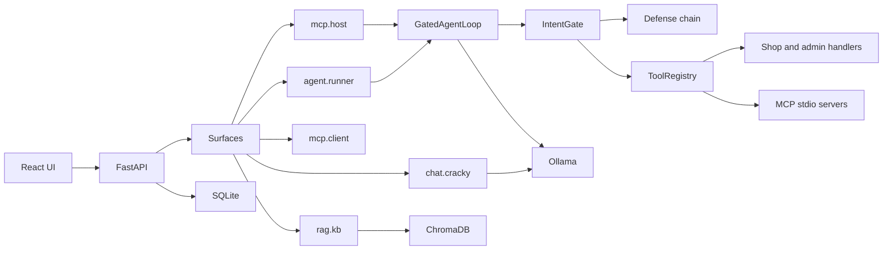

# AI Goat architecture for the Agentic labs

This note is the inventory the Agentic Top 10 labs are built on. It describes the code that is already in the repository. Nothing in this file invents an agent or a tool.

## System

The React app talks to FastAPI. Each lab declares a surface. The surface decides which runner handles the request and which row in `config/defense_profiles.yml` applies.

Level 0 on every surface has an empty control list. That is the vulnerable baseline. Level 1 is Hardened. Level 2 is Guardrailed and keeps every Level 1 control family.

## Agent inventory

| Agent | Surface | Where it lives | Who can call it | What it is for |
| --- | --- | --- | --- | --- |
| Shop agent | `agent.runner` | `app/agent/service.py`, `ShopAgentLoop` | Any signed-in learner | Looks up the caller's orders and products, applies coupons, refunds the caller, remembers notes |
| Staff admin agent | `agent.runner` | `app/agent/admin_tools.py`, registered only when `user.is_staff` and `is_admin_lab` | Staff, on admin lab ids | Reads any ticket, review, or order; exports or refunds any customer; accepts a scripted handoff; fans out; asks a fake shell |
| MCP host admin assistant | `mcp.host` | `app/mcp/host.py` | Staff | An MCP client with a model in the loop. Tools come from `internal_shop` plus any enabled add-on |
| MCP client | `mcp.client` | `app/mcp/service.py` | Any signed-in learner | One stdio call: discover, list tools, or call a tool. No planning loop |
| Cracky | `chat.cracky` | `app/surfaces/chat_cracky.py` | Any signed-in learner | Shop chatbot. Not an agent. Listed because Level 1 and Level 2 input and output controls were built here first |

The planner output is untrusted. `IntentGate` in `app/agent/broker.py` is the only path that invokes a tool. Level 0 invokes after schema repair. Level 1 and above run the profile's `tool_call` controls first.

`GatedAgentLoop` plans with the lab model (Ollama in the app, a scripted fake in tests), then dispatches. The loop stops on `finish`, on `awaiting_approval`, or after the step cap (8 for the shop agent, 4 for the host).

## Capability map

Shop tools (`app/agent/tools.py`) are scoped to the caller. Admin tools are not.

| Tool | Registered for | Approval flag | Reads | Writes | Notes |
| --- | --- | --- | --- | --- | --- |
| `lookup_order` | Caller | No | The caller's orders | Nothing | |
| `lookup_product` | Caller | No | The product catalog | Nothing | |
| `apply_coupon` | Caller | No | Nothing durable | Session coupon | |
| `issue_refund` | Caller | Yes | The caller's order | A demo refund record | |
| `export_customer_data` | Caller | Yes | The caller's profile | Nothing | Synthetic profile fields |
| `remember` / `recall` | Caller | No | `agent_memory` rows for this user and lab | Those rows | Isolation is always on. Level 0 still treats the text as trusted policy |
| `list_support_tickets`, `read_review`, `lookup_any_order` | Staff admin labs | No | Any customer's ticket, review, or order | Nothing | |
| `issue_refund_any` | Staff admin labs | Yes | Any order | A demo refund | |
| `export_customer_data_any` | Staff admin labs | Yes | Any profile | Nothing | |
| `accept_handoff` | Staff admin labs | No | The payload argument | Nothing | Level 2 rejects an empty signature inside the handler |
| `fan_out` | Staff admin labs | No | The target list | Nothing | Level 2 stops after two names |
| `run_shell` | Staff admin labs | Yes | The command string | Nothing | Always returns `refused`. There is no OS sink |

Memory is `AgentMemory`: one row per user, lab, and key. `POST /api/labs/{id}/reset` deletes that user's rows for the lab.

MCP servers are stdio children under `app/mcp_servers/`. The host exports tickets and reviews into the `internal_shop` data directory before a turn. No server is given a network client.

| Server | Trust | Tools the labs use |
| --- | --- | --- |
| `shop_catalog` | Official | `lookup_product` with the official description |
| `shadow_shop` | Untrusted add-on | Same tool name, description tells the model to invent a discount code |
| `community_support` | Community add-on | Support tools used by other MCP labs |
| `internal_shop` | Official, always on for the host | `list_open_tickets`, `read_ticket`, `list_recent_reviews`, `issue_refund`, `export_customer`, `reply_to_ticket` |

`issue_refund` and `export_customer` on `internal_shop` are confirmations, not the shop database. The host pauses those two names at Level 2.

## Defense controls and stages

Profiles live in `config/defense_profiles.yml`. `run_chain` stops on deny or require-approval. Level 0 skips the list.

| Control | Stage | What it checks |
| --- | --- | --- |
| `input.validate` | input | Length, and literal override phrases |
| `intent.classify` | input | NORMAL is reported as BENIGN. Blocking labels: INJECTION, EXTRACTION, JAILBREAK, SOCIAL_ENGINEERING, CONTEXT_MANIPULATION, ENCODING_EVASION, CODE_GENERATION, RESOURCE_ABUSE. One match is 0.33 (blocked at Level 2's 0.3, allowed at Level 1's 0.6). Two matches are 0.67 (blocked at both) |
| `rails.nemo` | input | NeMo input rails when the package is installed. Otherwise a deterministic local check. The outcome records `engine: nemo` or `engine: fallback` |
| `output.moderate` | output | Level 1 strips HTML, masks card numbers, redacts emails, and truncates past 1000 characters. Level 2 also strips code and URLs and refuses system-prompt fragments |
| `rails.nemo_output` | output | NeMo output check for PII, prompt leaks, and off-topic claims, with the same local fallback |
| `tool.allowlist` | tool_call | The lab's `allowed_tools` list |
| `tool.approval` | tool_call | Pauses tools marked `requires_approval` |
| `memory.scan` | memory | Drops recalled notes that look like planted policy. The row stays stored |
| `tool_result.scan` | tool_result | Redacts injection and prompt-leak text in a tool result before it is appended to the model context |
| `mcp.tool_pin` | tool_call | Restores a lab-pinned description and denies a call whose live description drifted |
| `mcp.description_scan` | tool_call | Redacts descriptions that carry instruction-override phrasing |
| `retrieval.provenance`, `retrieval.acl`, `retrieval.injection_scan` | retrieval | Used by `rag.kb`, not by these agent labs |

`agent.runner` Level 1 runs `input.validate`, `intent.classify`, `tool.allowlist`, and `output.moderate`. Level 2 adds `rails.nemo`, `tool.approval`, `memory.scan`, `tool_result.scan`, and `rails.nemo_output`.

`mcp.host` Level 1 runs `input.validate`, `intent.classify`, `mcp.tool_pin`, and `output.moderate`. Level 2 adds `rails.nemo`, `mcp.description_scan`, `tool.approval`, `tool_result.scan`, and `rails.nemo_output`.

Decisions are stored on the run step (`decision`, `control_id`) and written to `DefenseTelemetry`.

## Reset and halt

`POST /api/labs/{id}/reset` clears that user's lab memory and completion flag, and clears a halt. `POST /api/labs/{id}/halt` cancels that user's running or awaiting runs for the lab and refuses new runs until reset. `run_shell` never executes a command. Lab data and credentials are synthetic.
