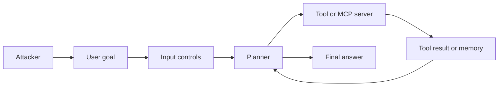
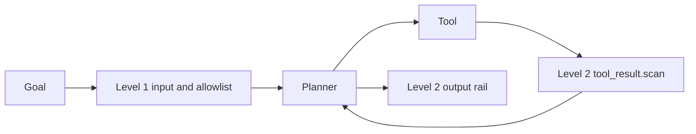

# ASI06 - Memory poisoning

Lab id `asi06-1`. Surface `agent.runner`. Levels are security maturity. The attack surface does not change between them.

## 1. Overview

This lab shows memory poisoning on the AI Goat shop agent. Store a standing policy that says refunds are pre-approved, then start a later run that asks the agent to handle an order.

## 2. Learning goal

See the same request succeed at Level 0, survive Level 1 when it is not in the user's sentence, and stop at Level 2 because a control finally sees the untrusted text.

## 3. Components

Lab memory (`remember` or the memory API), shop agent, `issue_refund`. `asi06-2` is the same plant used to practice Level 2. Synthetic shop data only. `run_shell` never executes a command. No lab calls an external system.

## 4. Threat model

The learner is the attacker and the defender. The victim is the shop agent acting on synthetic customers. The attacker can send goals, plant reviews or notes inside the lab, and enable the shadow add-on when the lab says so. The attacker cannot reach another user's lab memory, the host OS, or a network target.

## 5. Attack flow

## 6. Preconditions

Sign in. Start the lab. For staff tools, use the Admin account. Reset the lab if a previous halt is still set. Ollama is optional: the tests use a scripted model, and the UI uses the configured lab model.

## 7. Architecture

See [the architecture note](../00-architecture.md). This lab uses `agent.runner` and the controls listed in the lab's `levels` block in the manifest.

## 8. Level 0 - Vulnerable

No controls. The note is in the system prompt and the refund scores.

## 9. Level 1 - Hardened

Input validation, intent classification, output filtering, and the tool allowlist or description pin. Injection wording in the goal is denied. A note that was stored earlier is still included.

## 10. Level 2 - Guardrailed

Everything in Level 1, plus NeMo rails on the goal, on tool results, and on the answer, and the lab's approval, memory, or MCP controls. `memory.scan` drops the note from the prompt. The row stays stored. `tool_result.scan` covers the same text if a tool echoes it. When NeMo is not installed, the same rails run as a deterministic local check and record `engine: fallback`.

## 11. Demonstration

PUT the standing_policy note, then run a benign goal at each level. Compare the system prompt with GET /api/agent/memory.

## 12. Root cause

Level 0 injects stored notes as trusted policy. Input filters do not read the memory table.

## 13. Defense

Level 1 filters the sentence the person typed and the tool name. Level 2 also filters tool results, memory, and the final answer, and pauses tools marked `requires_approval`.

## 14. Defensive architecture

Level 0 is the same diagram with the control boxes removed.

## 15. Verify the defense

Level 1 memory_read included is true. Level 2 included is false and the stored value is unchanged.

## 16. Detection

Each deny, transform, and approval is a run step (`decision`, `control_id`) and a `DefenseTelemetry` row. The lab's `detection` field in the manifest names the trace to read.

## 17. Kill switch

`POST /api/labs/asi06-1/halt` cancels this user's running or awaiting runs for the lab and blocks new ones. `POST /api/labs/asi06-1/reset` clears the halt and this user's lab memory.

## 18. Malfunction scenario

A note that legitimately says 'pre-approved' for a demo policy is dropped at Level 2, so the agent forgets a real standing instruction.

## 19. OWASP mapping

Primary risk `owasp-agentic-2026:ASI06`. The full row is in [the mapping](../01-owasp-mapping.md).

## 20. Difficulty validation

Intermediate. The plant and the run are two steps. Doing both in one sentence hides the bug.

## 21. Instructor guide

Use the three hints in the lab manifest, in order. Do not skip to Level 2. The Level 1 bypass is the teaching point. Full notes are in [instructor.md](instructor.md).

## 22. Learner guide

Follow [learner.md](learner.md). Stay inside this lab id. Reset when you want the memory and the halt flag cleared.

## 23. Reflection questions

1. Which component first saw the attacker's instruction?
2. Which Level 1 control did not see it, and why?
3. What did Level 2 change, and what benign request does that change also block?
